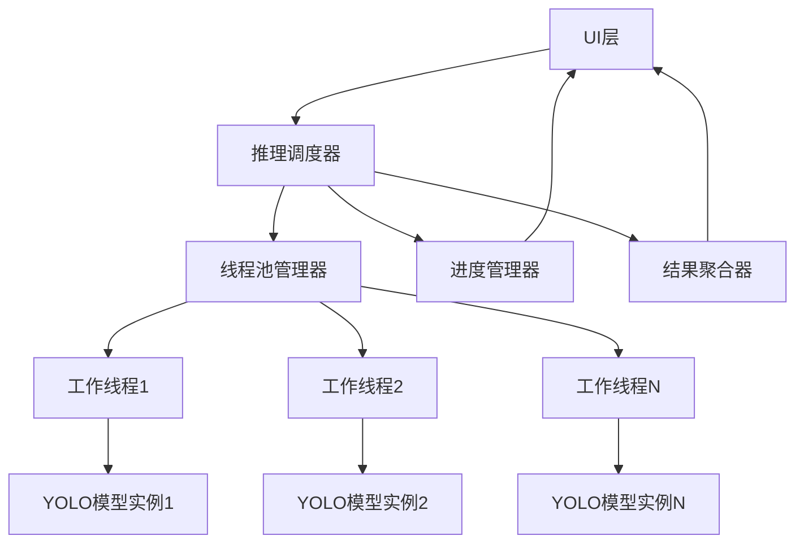

# AIlable项目 - AI推理多线程优化方案

## 问题分析

### 当前性能瓶颈
1. **单线程推理**: 所有AI模型服务都采用同步单线程推理
2. **批量处理效率低**: `InferBatchAsync`方法实际上是串行处理每张图片
3. **UI阻塞**: 大量图片推理时会阻塞UI线程
4. **资源利用不充分**: 未充分利用多核CPU和GPU资源
5. **内存管理**: 大图片处理时内存占用过高

### 性能影响
- **处理时间**: 100张图片可能需要几分钟甚至更长时间
- **用户体验**: 界面卡顿，无法取消操作
- **系统资源**: CPU利用率低，内存峰值高

## 多线程优化架构设计

### 1. 整体架构



### 2. 核心组件设计

#### 2.1 推理任务调度器 (InferenceScheduler)
```csharp
public class InferenceScheduler
{
    private readonly SemaphoreSlim _semaphore;
    private readonly CancellationTokenSource _cancellationTokenSource;
    private readonly IProgress<InferenceProgress> _progressReporter;
    private readonly ConcurrentQueue<InferenceTask> _taskQueue;
    private readonly List<Task> _workerTasks;
    
    public async Task<Dictionary<string, IEnumerable<Annotation>>> ProcessBatchAsync(
        IEnumerable<string> imagePaths,
        float confidenceThreshold,
        int maxConcurrency = Environment.ProcessorCount,
        IProgress<InferenceProgress> progress = null,
        CancellationToken cancellationToken = default)
}
```

#### 2.2 推理任务定义 (InferenceTask)
```csharp
public class InferenceTask
{
    public string ImagePath { get; set; }
    public float ConfidenceThreshold { get; set; }
    public TaskCompletionSource<IEnumerable<Annotation>> CompletionSource { get; set; }
    public DateTime CreatedAt { get; set; }
    public int RetryCount { get; set; }
}
```

#### 2.3 进度报告 (InferenceProgress)
```csharp
public class InferenceProgress
{
    public int TotalTasks { get; set; }
    public int CompletedTasks { get; set; }
    public int FailedTasks { get; set; }
    public double ProgressPercentage => TotalTasks > 0 ? (double)CompletedTasks / TotalTasks * 100 : 0;
    public TimeSpan ElapsedTime { get; set; }
    public TimeSpan EstimatedRemainingTime { get; set; }
    public string CurrentImagePath { get; set; }
    public double AverageProcessingTime { get; set; }
    public long MemoryUsage { get; set; }
}
```

## 具体实现方案

### 1. 多线程YOLO模型服务

<write_to_file>
<path>AIlable/AIlable/Services/MultiThreadYoloModelService.cs</path>
<content>
using System;
using System.Collections.Concurrent;
using System.Collections.Generic;
using System.Diagnostics;
using System.IO;
using System.Linq;
using System.Threading;
using System.Threading.Tasks;
using Microsoft.ML.OnnxRuntime;
using Microsoft.ML.OnnxRuntime.Tensors;
using SixLabors.ImageSharp;
using SixLabors.ImageSharp.PixelFormats;
using SixLabors.ImageSharp.Processing;
using AIlable.Models;

namespace AIlable.Services;

/// <summary>
/// 多线程YOLO模型推理服务
/// </summary>
public class MultiThreadYoloModelService : IAIModelService
{
    private readonly object _lockObject = new();
    private readonly List<InferenceSession> _sessions = new();
    private readonly SemaphoreSlim _sessionSemaphore;
    private string[]? _classNames;
    private readonly List<string> _projectLabels;
    private string _modelPath = string.Empty;
    
    public bool IsModelLoaded => _sessions.Count > 0;
    public string ModelName { get; private set; } = string.Empty;
    public AIModelType ModelType => AIModelType.YOLO;
    
    // YOLO模型默认输入尺寸
    private const int InputWidth = 640;
    private const int InputHeight = 640;
    
    // 默认最大并发数
    private readonly int _maxConcurrency;
    
    /// <summary>
    /// 构造函数
    /// </summary>
    /// <param name="projectLabels">项目标签列表</param>
    /// <param name="maxConcurrency">最大并发数，默认为CPU核心数</param>
    public MultiThreadYoloModelService(List<string>? projectLabels = null, int maxConcurrency = 0)
    {
        _projectLabels = projectLabels ?? new List<string>();
        _maxConcurrency = maxConcurrency > 0 ? maxConcurrency : Environment.ProcessorCount;
        _sessionSemaphore = new SemaphoreSlim(_maxConcurrency, _maxConcurrency);
    }
    
    public async Task<bool> LoadModelAsync(string modelPath)
    {
        try
        {
            if (!File.Exists(modelPath))
            {
                Console.WriteLine($"Model file not found: {modelPath}");
                return false;
            }
            
            _modelPath = modelPath;
            ModelName = Path.GetFileNameWithoutExtension(modelPath);
            
            // 创建多个ONNX运行时会话实例
            var sessionOptions = GetOptimalSessionOptions();
            
            lock (_lockObject)
            {
                // 清理现有会话
                foreach (var session in _sessions)
                {
                    session?.Dispose();
                }
                _sessions.Clear();
                
                // 创建多个会话实例
                for (int i = 0; i < _maxConcurrency; i++)
                {
                    var session = new InferenceSession(modelPath, sessionOptions);
                    _sessions.Add(session);
                }
            }
            
            // 加载类别名称
            await LoadClassNamesAsync(modelPath);
            
            Console.WriteLine($"Multi-thread YOLO model loaded successfully: {ModelName} with {_maxConcurrency} instances");
            return true;
        }
        catch (Exception ex)
        {
            Console.WriteLine($"Error loading multi-thread YOLO model: {ex.Message}");
            UnloadModel();
            return false;
        }
    }
    
    private SessionOptions GetOptimalSessionOptions()
    {
        var options = new SessionOptions();
        
        // 根据平台优化配置
        if (OperatingSystem.IsAndroid() || OperatingSystem.IsIOS())
        {
            // 移动平台优化
            options.ExecutionMode = ExecutionMode.ORT_SEQUENTIAL;
            options.GraphOptimizationLevel = GraphOptimizationLevel.ORT_ENABLE_BASIC;
            options.EnableMemoryPattern = false; // 减少内存使用
        }
        else if (OperatingSystem.IsBrowser())
        {
            // Browser平台优化
            options.ExecutionMode = ExecutionMode.ORT_SEQUENTIAL;
            options.GraphOptimizationLevel = GraphOptimizationLevel.ORT_ENABLE_BASIC;
        }
        else
        {
            // Desktop平台优化
            options.ExecutionMode = ExecutionMode.ORT_PARALLEL;
            options.GraphOptimizationLevel = GraphOptimizationLevel.ORT_ENABLE_ALL;
            options.EnableCpuMemArena = true;
            options.EnableMemoryPattern = true;
            
            // 设置线程数
            options.IntraOpNumThreads = Math.Max(1, Environment.ProcessorCount / _maxConcurrency);
            options.InterOpNumThreads = 1; // 避免过度并行化
        }
        
        return options;
    }
    
    private async Task LoadClassNamesAsync(string modelPath)
    {
        try
        {
            // 优先使用项目标签
            if (_projectLabels != null && _projectLabels.Count > 0)
            {
                _classNames = _projectLabels.ToArray();
                Console.WriteLine($"使用项目标签: {_classNames.Length} 个类别");
                return;
            }
            
            // 尝试查找同名的.names或.txt文件
            var modelDir = Path.GetDirectoryName(modelPath);
            var modelName = Path.GetFileNameWithoutExtension(modelPath);
            
            var possibleClassFiles = new[]
            {
                Path.Combine(modelDir!, $"{modelName}.names"),
                Path.Combine(modelDir!, $"{modelName}.txt"),
                Path.Combine(modelDir!, "classes.names"),
                Path.Combine(modelDir!, "classes.txt")
            };
            
            foreach (var classFile in possibleClassFiles)
            {
                if (File.Exists(classFile))
                {
                    var lines = await File.ReadAllLinesAsync(classFile);
                    _classNames = lines.Where(line => !string.IsNullOrWhiteSpace(line)).ToArray();
                    Console.WriteLine($"从文件加载 {_classNames.Length} 个类别: {classFile}");
                    return;
                }
            }
            
            // 使用默认COCO类别
            _classNames = GetCocoClassNames();
            Console.WriteLine("使用默认COCO类别名称");
        }
        catch (Exception ex)
        {
            Console.WriteLine($"加载类别名称出错: {ex.Message}");
            _classNames = GetCocoClassNames();
        }
    }
    
    private static string[] GetCocoClassNames()
    {
        return new[]
        {
            "person", "bicycle", "car", "motorcycle", "airplane", "bus", "train", "truck", "boat",
            "traffic light", "fire hydrant", "stop sign", "parking meter", "bench", "bird", "cat",
            "dog", "horse", "sheep", "cow", "elephant", "bear", "zebra", "giraffe", "backpack",
            "umbrella", "handbag", "tie", "suitcase", "frisbee", "skis", "snowboard", "sports ball",
            "kite", "baseball bat", "baseball glove", "skateboard", "surfboard", "tennis racket",
            "bottle", "wine glass", "cup", "fork", "knife", "spoon", "bowl", "banana", "apple",
            "sandwich", "orange", "broccoli", "carrot", "hot dog", "pizza", "donut", "cake",
            "chair", "couch", "potted plant", "bed", "dining table", "toilet", "tv", "laptop",
            "mouse", "remote", "keyboard", "cell phone", "microwave", "oven", "toaster", "sink",
            "refrigerator", "book", "clock", "vase", "scissors", "teddy bear", "hair drier", "toothbrush"
        };
    }
    
    public void UpdateProjectLabels(List<string> projectLabels)
    {
        _projectLabels.Clear();
        _projectLabels.AddRange(projectLabels);
        
        if (IsModelLoaded && _projectLabels.Count > 0)
        {
            _classNames = _projectLabels.ToArray();
            Console.WriteLine($"更新模型类别为项目标签: {_classNames.Length} 个类别");
        }
    }
    
    public void UnloadModel()
    {
        lock (_lockObject)
        {
            foreach (var session in _sessions)
            {
                session?.Dispose();
            }
            _sessions.Clear();
        }
        
        _classNames = null;
        ModelName = string.Empty;
        _modelPath = string.Empty;
    }
    
    public async Task<IEnumerable<Annotation>> InferAsync(string imagePath, float confidenceThreshold = 0.5f)
    {
        if (!IsModelLoaded || !File.Exists(imagePath))
        {
            return Array.Empty<Annotation>();
        }
        
        // 获取一个可用的会话
        await _sessionSemaphore.WaitAsync();
        
        try
        {
            InferenceSession session;
            lock (_lockObject)
            {
                session = _sessions.FirstOrDefault();
                if (session == null)
                {
                    return Array.Empty<Annotation>();
                }
            }
            
            using var image = await Image.LoadAsync<Rgb24>(imagePath);
            var originalWidth = image.Width;
            var originalHeight = image.Height;
            
            // 预处理图像
            var input = PreprocessImage(image);
            
            // 运行推理
            var inputName = session.InputMetadata.Keys.FirstOrDefault() ?? "images";
            var inputs = new List<NamedOnnxValue> { NamedOnnxValue.CreateFromTensor(inputName, input) };
            
            using var results = session.Run(inputs);
            var output = results.FirstOrDefault()?.AsTensor<float>();
            
            if (output == null)
                return Array.Empty<Annotation>();
            
            // 后处理结果
            return PostprocessResults(output, originalWidth, originalHeight, confidenceThreshold);
        }
        catch (Exception ex)
        {
            Console.WriteLine($"Error during YOLO inference: {ex.Message}");
            return Array.Empty<Annotation>();
        }
        finally
        {
            _sessionSemaphore.Release();
        }
    }
    
    public async Task<Dictionary<string, IEnumerable<Annotation>>> InferBatchAsync(
        IEnumerable<string> imagePaths, 
        float confidenceThreshold = 0.5f)
    {
        var imagePathsList = imagePaths.ToList();
        var results = new ConcurrentDictionary<string, IEnumerable<Annotation>>();
        
        // 使用并行处理
        var parallelOptions = new ParallelOptions
        {
            MaxDegreeOfParallelism = _maxConcurrency,
            CancellationToken = CancellationToken.None
        };
        
        await Parallel.ForEachAsync(imagePathsList, parallelOptions, async (imagePath, ct) =>
        {
            try
            {
                var annotations = await InferAsync(imagePath, confidenceThreshold);
                results[imagePath] = annotations;
            }
            catch (Exception ex)
            {
                Console.WriteLine($"Error processing {imagePath}: {ex.Message}");
                results[imagePath] = Array.Empty<Annotation>();
            }
        });
        
        return new Dictionary<string, IEnumerable<Annotation>>(results);
    }
    
    /// <summary>
    /// 高级批量推理，支持进度报告和取消
    /// </summary>
    public async Task<Dictionary<string, IEnumerable<Annotation>>> InferBatchAdvancedAsync(
        IEnumerable<string> imagePaths,
        float confidenceThreshold = 0.5f,
        IProgress<InferenceProgress>? progress = null,
        CancellationToken cancellationToken = default)
    {
        var imagePathsList = imagePaths.ToList();
        var results = new ConcurrentDictionary<string, IEnumerable<Annotation>>();
        var completed = 0;
        var failed = 0;
        var stopwatch = Stopwatch.StartNew();
        var processingTimes = new ConcurrentQueue<double>();
        
        // 初始进度报告
        var totalTasks = imagePathsList.Count;
        progress?.Report(new InferenceProgress
        {
            TotalTasks = totalTasks,
            CompletedTasks = 0,
            FailedTasks = 0,
            ElapsedTime = TimeSpan.Zero,
            EstimatedRemainingTime = TimeSpan.Zero,
            CurrentImagePath = string.Empty,
            AverageProcessingTime = 0,
            MemoryUsage = GC.GetTotalMemory(false)
        });
        
        var parallelOptions = new ParallelOptions
        {
            MaxDegreeOfParallelism = _maxConcurrency,
            CancellationToken = cancellationToken
        };
        
        try
        {
            await Parallel.ForEachAsync(imagePathsList, parallelOptions, async (imagePath, ct) =>
            {
                var taskStopwatch = Stopwatch.StartNew();
                
                try
                {
                    ct.ThrowIfCancellationRequested();
                    
                    var annotations = await InferAsync(imagePath, confidenceThreshold);
                    results[imagePath] = annotations;
                    
                    taskStopwatch.Stop();
                    processingTimes.Enqueue(taskStopwatch.Elapsed.TotalMilliseconds);
                    
                    var completedCount = Interlocked.Increment(ref completed);
                    
                    // 报告进度
                    if (progress != null)
                    {
                        var avgTime = processingTimes.Count > 0 ? processingTimes.Average() : 0;
                        var remaining = totalTasks - completedCount;
                        var estimatedRemaining = TimeSpan.FromMilliseconds(avgTime * remaining);
                        
                        progress.Report(new InferenceProgress
                        {
                            TotalTasks = totalTasks,
                            CompletedTasks = completedCount,
                            FailedTasks = failed,
                            ElapsedTime = stopwatch.Elapsed,
                            EstimatedRemainingTime = estimatedRemaining,
                            CurrentImagePath = Path.GetFileName(imagePath),
                            AverageProcessingTime = avgTime,
                            MemoryUsage = GC.GetTotalMemory(false)
                        });
                    }
                }
                catch (OperationCanceledException)
                {
                    throw; // 重新抛出取消异常
                }
                catch (Exception ex)
                {
                    Console.WriteLine($"Error processing {imagePath}: {ex.Message}");
                    results[imagePath] = Array.Empty<Annotation>();
                    Interlocked.Increment(ref failed);
                    Interlocked.Increment(ref completed);
                }
            });
        }
        catch (OperationCanceledException)
        {
            Console.WriteLine("Batch inference was cancelled");
        }
        
        stopwatch.Stop();
        
        // 最终进度报告
        progress?.Report(new InferenceProgress
        {
            TotalTasks = totalTasks,
            CompletedTasks = completed,
            FailedTasks = failed,
            ElapsedTime = stopwatch.Elapsed,
            EstimatedRemainingTime = TimeSpan.Zero,
            CurrentImagePath = "完成",
            AverageProcessingTime = processingTimes.Count > 0 ? processingTimes.Average() : 0,
            MemoryUsage = GC.GetTotalMemory(false)
        });
        
        // 强制垃圾回收
        GC.Collect();
        GC.WaitForPendingFinalizers();
        GC.Collect();
        
        return new Dictionary<string, IEnumerable<Annotation>>(results);
    }
    
    private Tensor<float> PreprocessImage(Image<Rgb24> image)
    {
        // 调整图像大小并保持长宽比
        image.Mutate(x => x.Resize(new ResizeOptions
        {
            Size = new Size(InputWidth, InputHeight),
            Mode = ResizeMode.Pad,
            PadColor = Color.Black
        }));
        
        // 创建输入张量 [batch_size, channels, height, width]
        var tensor = new DenseTensor<float>(new[] { 1, 3, InputHeight, InputWidth });
        
        // 将图像数据转换为张量，并进行归一化 (0-255 -> 0-1)
        for (int y = 0; y < InputHeight; y++)
        {
            for (int x = 0; x < InputWidth; x++)
            {
                var pixel = image[x, y];
                tensor[0, 0, y, x] = pixel.R / 255.0f; // R
                tensor[0, 1, y, x] = pixel.G / 255.0f; // G  
                tensor[0, 2, y, x] = pixel.B / 255.0f; // B
            }
        }
        
        return tensor;
    }
    
    private List<Annotation> PostprocessResults(Tensor<float> output, int originalWidth, int originalHeight, float confidenceThreshold)
    {
        var annotations = new List<Annotation>();

        var outputDims = output.Dimensions.ToArray();

        // 检查是否是已经过NMS处理的输出格式 [1, 300, 6]
        if (outputDims.Length == 3 && outputDims[1] <= 300 && outputDims[2] == 6)
        {
            // 格式: [1, 300, 6] - 已经过NMS处理
            var numDetections = outputDims[1];

            // 计算缩放比例和填充偏移
            var scaleX = (float)InputWidth / originalWidth;
            var scaleY = (float)InputHeight / originalHeight;
            var scale = Math.Min(scaleX, scaleY);
            
            var scaledWidth = originalWidth * scale;
            var scaledHeight = originalHeight * scale;
            var padX = (InputWidth - scaledWidth) / 2;
            var padY = (InputHeight - scaledHeight) / 2;

            for (int i = 0; i < numDetections; i++)
            {
                var confidence = output[0, i, 4];
                var classId = (int)output[0, i, 5];

                if (confidence < confidenceThreshold)
                    continue;

                var x1_model = output[0, i, 0];
                var y1_model = output[0, i, 1];
                var x2_model = output[0, i, 2];
                var y2_model = output[0, i, 3];

                // 坐标转换
                var x1 = (x1_model - padX) / scale;
                var y1 = (y1_model - padY) / scale;
                var x2 = (x2_model - padX) / scale;
                var y2 = (y2_model - padY) / scale;

                // 确保坐标在图像范围内
                x1 = Math.Max(0, Math.Min(originalWidth, x1));
                y1 = Math.Max(0, Math.Min(originalHeight, y1));
                x2 = Math.Max(0, Math.Min(originalWidth, x2));
                y2 = Math.Max(0, Math.Min(originalHeight, y2));

                if (x2 <= x1 || y2 <= y1) continue;

                var className = GetClassName(classId);
                var annotation = new RectangleAnnotation
                {
                    Id = Guid.NewGuid().ToString(),
                    Label = $"{className} ({confidence:F2})",
                    TopLeft = new Point2D(x1, y1),
                    BottomRight = new Point2D(x2, y2),
                    Color = "#FF0000",
                    StrokeWidth = 2,
                    IsVisible = true
                };

                annotations.Add(annotation);
            }
        }
        else if (outputDims.Length == 3 && outputDims[1] > outputDims[2])
        {
            // 格式: [1, 84, 8400] -> 需要转置和NMS处理
            var numFeatures = outputDims[1];
            var numDetections = outputDims[2];
            
            var detections = new List<Detection>();
            
            for (int i = 0; i < numDetections; i++)
            {
                var centerX = output[0, 0, i];
                var centerY = output[0, 1, i];
                var width = output[0, 2, i];
                var height = output[0, 3, i];

                var maxClassScore = 0.0f;
                var maxClassIndex = 0;

                for (int j = 4; j < numFeatures; j++)
                {
                    var classScore = output[0, j, i];
                    if (classScore > maxClassScore)
                    {
                        maxClassScore = classScore;
                        maxClassIndex = j - 4;
                    }
                }

                if (maxClassScore < confidenceThreshold)
                    continue;
                
                var x1 = centerX - width / 2;
                var y1 = centerY - height / 2;
                var x2 = centerX + width / 2;
                var y2 = centerY + height / 2;
                
                detections.Add(new Detection
                {
                    X1 = x1, Y1 = y1, X2 = x2, Y2 = y2,
                    Confidence = maxClassScore,
                    ClassId = maxClassIndex
                });
            }
            
            // 应用NMS
            var nmsResults = ApplyNMS(detections, 0.45f);
            
            // 转换为标注
            var scaleX = (float)InputWidth / originalWidth;
            var scaleY = (float)InputHeight / originalHeight;
            var scale = Math.Min(scaleX, scaleY);
            
            var scaledWidth = originalWidth * scale;
            var scaledHeight = originalHeight * scale;
            var padX = (InputWidth - scaledWidth) / 2;
            var padY = (InputHeight - scaledHeight) / 2;
            
            foreach (var detection in nmsResults)
            {
                var x1 = (detection.X1 - padX) / scale;
                var y1 = (detection.Y1 - padY) / scale;
                var x2 = (detection.X2 - padX) / scale;
                var y2 = (detection.Y2 - padY) / scale;

                x1 = Math.Max(0, Math.Min(originalWidth, x1));
                y1 = Math.Max(0, Math.Min(originalHeight, y1));
                x2 = Math.Max(0, Math.Min(originalWidth, x2));
                y2 = Math.Max(0, Math.Min(originalHeight, y2));

                if (x2 <= x1 || y2 <= y1) continue;

                var className = GetClassName(detection.ClassId);
                var annotation = new RectangleAnnotation
                {
                    Id = Guid.NewGuid().ToString(),
                    Label = $"{className} ({detection.Confidence:F2})",
                    TopLeft = new Point2D(x1, y1),
                    BottomRight = new Point2D(x2, y2),
                    Color = "#FF0000",
                    StrokeWidth = 2,
                    IsVisible = true
                };

                annotations.Add(annotation);
            }
        }

        return annotations;
    }
    
    private string GetClassName(int classIndex)
    {
        if (_classNames != null && classIndex >= 0 && classIndex < _classNames.Length)
        {
            return _classNames[classIndex];
        }
        return $"class_{classIndex}";
    }
    
    // 检测结果类
    private class Detection
    {
        public float X1 { get; set; }
        public float Y1 { get; set; }
        public float X2 { get; set; }
        public float Y2 { get; set; }
        public float Confidence { get; set; }
        public int ClassId { get; set; }
        public float Area => (X2 - X1) * (Y2 - Y1);
    }
    
    // NMS实现
    private List<Detection> ApplyNMS(List<Detection> detections, float iouThreshold)
    {
        if (detections.Count == 0) return new List<Detection>();
        
        detections.Sort((a, b) => b.Confidence.CompareTo(a.Confidence));
        
        var result = new List<Detection>();
        var suppressed = new bool[detections.Count];
        
        for (int i = 0; i < detections.Count; i++)
        {
            if (suppressed[i]) continue;
            
            result.Add(detections[i]);
            
            for (int j = i + 1; j < detections.Count; j++)
            {
                if (suppressed[j]) continue;
                
                var iou = CalculateIoU(detections[i], detections[j]);
                if (iou > iouThreshold)
                {
                    suppressed[j] = true;
                }
            }
        }
        
        return result;
    }
    
    // 计算IoU
    private float CalculateIoU(Detection a, Detection b)
    {
        var intersectionX1 = Math.Max(a.X1, b.X1);
        var intersectionY1 = Math.Max(a.Y1, b.Y1);
        var intersectionX2 = Math.Min(a.X2, b.X2);
        var intersectionY2 = Math.Min(a.Y2, b.Y2);
        
        if (intersectionX2 <= intersectionX1 || intersectionY2 <= intersectionY1)
            return 0.0f;
        
        var intersectionArea = (intersectionX2 - intersectionX1) * (intersectionY2 - intersectionY1);
        var unionArea = a.Area + b.Area - intersectionArea;
        
        return unionArea > 0 ? intersectionArea / unionArea : 0.0f;
    }
    
    public void Dispose()
    {
        UnloadModel();
        _sessionSemaphore?.Dispose();
    }
}