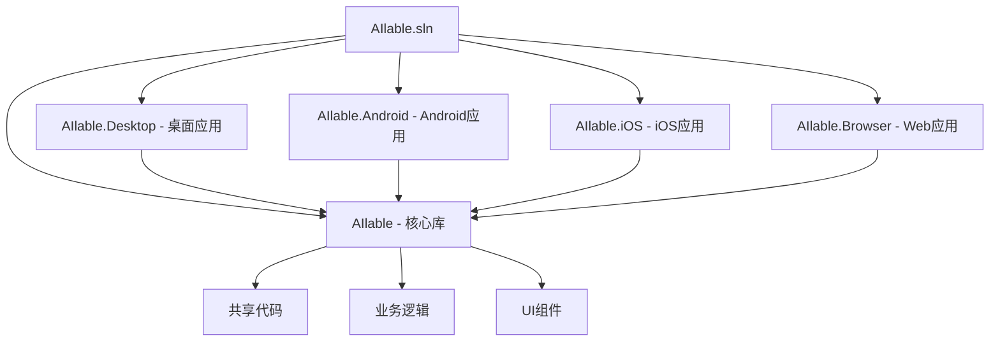

# AIlable项目 - 构建和部署分析文档

## 概述

AIlable项目采用现代化的.NET构建系统，支持多平台构建和部署。项目使用中央包管理、统一版本控制，并针对不同平台提供了专门的构建配置。本文档详细分析项目的构建流程、部署策略和发布配置。

## 构建系统架构

### 1. 解决方案结构



### 2. 中央包管理系统

**Directory.Packages.props 配置**:
```xml
<Project>
  <PropertyGroup>
    <ManagePackageVersionsCentrally>true</ManagePackageVersionsCentrally>
    <CentralPackageTransitivePinningEnabled>true</CentralPackageTransitivePinningEnabled>
  </PropertyGroup>

  <ItemGroup>
    <!-- UI框架 -->
    <PackageVersion Include="Avalonia" Version="11.3.2" />
    <PackageVersion Include="Avalonia.Themes.Fluent" Version="11.3.2" />
    <PackageVersion Include="Avalonia.Desktop" Version="11.3.2" />
    <PackageVersion Include="Avalonia.Android" Version="11.3.2" />
    <PackageVersion Include="Avalonia.iOS" Version="11.3.2" />
    <PackageVersion Include="Avalonia.Browser" Version="11.3.2" />
    
    <!-- MVVM框架 -->
    <PackageVersion Include="CommunityToolkit.Mvvm" Version="8.4.0" />
    
    <!-- AI推理 -->
    <PackageVersion Include="Microsoft.ML.OnnxRuntime" Version="1.20.1" />
    <PackageVersion Include="Microsoft.ML.OnnxRuntime.Gpu" Version="1.20.1" />
    
    <!-- 图像处理 -->
    <PackageVersion Include="SixLabors.ImageSharp" Version="3.1.10" />
    <PackageVersion Include="SkiaSharp" Version="2.88.8" />
    
    <!-- 音频处理 -->
    <PackageVersion Include="NAudio" Version="2.2.1" />
    
    <!-- 序列化 -->
    <PackageVersion Include="Newtonsoft.Json" Version="13.0.3" />
    
    <!-- 依赖注入 -->
    <PackageVersion Include="Microsoft.Extensions.DependencyInjection" Version="9.0.0" />
    <PackageVersion Include="Microsoft.Extensions.Configuration" Version="9.0.0" />
    <PackageVersion Include="Microsoft.Extensions.Configuration.Json" Version="9.0.0" />
    
    <!-- 日志 -->
    <PackageVersion Include="Microsoft.Extensions.Logging" Version="9.0.0" />
    <PackageVersion Include="Serilog" Version="4.2.0" />
    <PackageVersion Include="Serilog.Extensions.Logging" Version="8.0.0" />
    <PackageVersion Include="Serilog.Sinks.File" Version="6.0.0" />
  </ItemGroup>
</Project>
```

**中央包管理优势**:
- **版本统一**: 所有项目使用相同版本的依赖包
- **维护简化**: 只需在一个地方更新包版本
- **依赖透明**: 清晰显示所有项目的依赖关系
- **冲突避免**: 避免不同项目间的版本冲突

## 平台特定构建配置

### 1. 桌面平台 (AIlable.Desktop)

**项目文件配置**:
```xml
<Project Sdk="Microsoft.NET.Sdk">
  <PropertyGroup>
    <OutputType>WinExe</OutputType>
    <TargetFramework>net9.0</TargetFramework>
    <Nullable>enable</Nullable>
    <BuiltInComInteropSupport>true</BuiltInComInteropSupport>
    <ApplicationManifest>app.manifest</ApplicationManifest>
    <AvaloniaUseCompiledBindingsByDefault>true</AvaloniaUseCompiledBindingsByDefault>
  </PropertyGroup>

  <ItemGroup>
    <PackageReference Include="Avalonia.Desktop" />
  </ItemGroup>

  <ItemGroup>
    <ProjectReference Include="..\AIlable\AIlable.csproj" />
  </ItemGroup>
</Project>
```

**应用程序清单 (app.manifest)**:
```xml
<?xml version="1.0" encoding="utf-8"?>
<assembly manifestVersion="1.0" xmlns="urn:schemas-microsoft-com:asm.v1">
  <assemblyIdentity version="1.0.0.0" name="AIlable.Desktop"/>
  
  <!-- Windows 10/11 兼容性 -->
  <compatibility xmlns="urn:schemas-microsoft-com:compatibility.v1">
    <application>
      <supportedOS Id="{8e0f7a12-bfb3-4fe8-b9a5-48fd50a15a9a}"/>
    </application>
  </compatibility>
  
  <!-- DPI感知 -->
  <application xmlns="urn:schemas-microsoft-com:asm.v3">
    <windowsSettings>
      <dpiAware xmlns="http://schemas.microsoft.com/SMI/2005/WindowsSettings">true</dpiAware>
      <dpiAwareness xmlns="http://schemas.microsoft.com/SMI/2016/WindowsSettings">PerMonitorV2</dpiAwareness>
    </windowsSettings>
  </application>
</assembly>
```

**构建特点**:
- **目标框架**: .NET 9.0，支持最新特性
- **COM互操作**: 启用内置COM互操作支持
- **编译绑定**: 使用编译时绑定提升性能
- **DPI感知**: 支持高DPI显示器
- **Windows兼容**: 支持Windows 10/11

### 2. Android平台 (AIlable.Android)

**项目文件配置**:
```xml
<Project Sdk="Microsoft.NET.Sdk">
  <PropertyGroup>
    <TargetFramework>net9.0-android</TargetFramework>
    <OutputType>Exe</OutputType>
    <Nullable>enable</Nullable>
    <ImplicitUsings>enable</ImplicitUsings>
    <ApplicationId>com.ailable.app</ApplicationId>
    <ApplicationVersion>1</ApplicationVersion>
    <ApplicationDisplayVersion>1.0</ApplicationDisplayVersion>
    <SupportedOSPlatformVersion>21</SupportedOSPlatformVersion>
  </PropertyGroup>

  <ItemGroup>
    <PackageReference Include="Avalonia.Android" />
  </ItemGroup>

  <ItemGroup>
    <ProjectReference Include="..\AIlable\AIlable.csproj" />
  </ItemGroup>
</Project>
```

**Android清单 (AndroidManifest.xml)**:
```xml
<manifest xmlns:android="http://schemas.android.com/apk/res/android" 
          android:installLocation="auto">
  
  <!-- 权限声明 -->
  <uses-permission android:name="android.permission.INTERNET" />
  <uses-permission android:name="android.permission.READ_EXTERNAL_STORAGE" />
  <uses-permission android:name="android.permission.WRITE_EXTERNAL_STORAGE" />
  <uses-permission android:name="android.permission.RECORD_AUDIO" />
  
  <!-- 应用配置 -->
  <application 
    android:label="AIlable" 
    android:icon="@drawable/Icon"
    android:theme="@style/MyTheme.Splash"
    android:hardwareAccelerated="true">
    
    <activity 
      android:name="crc64e1fb321c08285b90.MainActivity"
      android:exported="true"
      android:launchMode="singleTop"
      android:configChanges="orientation|keyboardHidden|keyboard|screenSize|smallestScreenSize|screenLayout|uiMode"
      android:windowSoftInputMode="adjustResize">
      
      <intent-filter>
        <action android:name="android.intent.action.MAIN" />
        <category android:name="android.intent.category.LAUNCHER" />
      </intent-filter>
    </activity>
  </application>
  
  <!-- 最低SDK版本 -->
  <uses-sdk android:minSdkVersion="21" android:targetSdkVersion="34" />
</manifest>
```

**构建特点**:
- **目标框架**: .NET 9.0 for Android
- **最低版本**: Android 5.0 (API 21)
- **权限管理**: 网络、存储、音频录制权限
- **硬件加速**: 启用GPU硬件加速
- **配置变更**: 处理屏幕旋转等配置变更

### 3. iOS平台 (AIlable.iOS)

**项目文件配置**:
```xml
<Project Sdk="Microsoft.NET.Sdk">
  <PropertyGroup>
    <TargetFramework>net9.0-ios</TargetFramework>
    <OutputType>Exe</OutputType>
    <Nullable>enable</Nullable>
    <ImplicitUsings>enable</ImplicitUsings>
    <SupportedOSPlatformVersion>13.0</SupportedOSPlatformVersion>
  </PropertyGroup>

  <ItemGroup>
    <PackageReference Include="Avalonia.iOS" />
  </ItemGroup>

  <ItemGroup>
    <ProjectReference Include="..\AIlable\AIlable.csproj" />
  </ItemGroup>
</Project>
```

**Info.plist 配置**:
```xml
<?xml version="1.0" encoding="UTF-8"?>
<plist version="1.0">
<dict>
  <!-- 应用信息 -->
  <key>CFBundleDisplayName</key>
  <string>AIlable</string>
  <key>CFBundleIdentifier</key>
  <string>com.ailable.app</string>
  <key>CFBundleVersion</key>
  <string>1.0</string>
  <key>CFBundleShortVersionString</key>
  <string>1.0</string>
  
  <!-- 系统要求 -->
  <key>MinimumOSVersion</key>
  <string>13.0</string>
  <key>UIDeviceFamily</key>
  <array>
    <integer>1</integer> <!-- iPhone -->
    <integer>2</integer> <!-- iPad -->
  </array>
  
  <!-- 权限描述 -->
  <key>NSMicrophoneUsageDescription</key>
  <string>AIlable需要访问麦克风进行语音录制功能</string>
  <key>NSPhotoLibraryUsageDescription</key>
  <string>AIlable需要访问相册来加载和保存图像</string>
  
  <!-- UI配置 -->
  <key>UILaunchStoryboardName</key>
  <string>LaunchScreen</string>
  <key>UIRequiredDeviceCapabilities</key>
  <array>
    <string>armv7</string>
  </array>
</dict>
</plist>
```

**构建特点**:
- **目标框架**: .NET 9.0 for iOS
- **最低版本**: iOS 13.0
- **设备支持**: iPhone和iPad
- **权限声明**: 麦克风、相册访问权限
- **启动画面**: 自定义启动界面

### 4. Browser平台 (AIlable.Browser)

**项目文件配置**:
```xml
<Project Sdk="Microsoft.NET.Sdk.BlazorWebAssembly">
  <PropertyGroup>
    <TargetFramework>net9.0</TargetFramework>
    <Nullable>enable</Nullable>
    <ImplicitUsings>enable</ImplicitUsings>
    <ServiceWorkerAssetsManifest>service-worker-assets.js</ServiceWorkerAssetsManifest>
  </PropertyGroup>

  <ItemGroup>
    <PackageReference Include="Avalonia.Browser" />
  </ItemGroup>

  <ItemGroup>
    <ProjectReference Include="..\AIlable\AIlable.csproj" />
  </ItemGroup>
</Project>
```

**运行时配置 (runtimeconfig.template.json)**:
```json
{
  "runtimeOptions": {
    "tfm": "net9.0",
    "frameworks": [
      {
        "name": "Microsoft.NETCore.App",
        "version": "9.0.0"
      },
      {
        "name": "Microsoft.AspNetCore.App",
        "version": "9.0.0"
      }
    ],
    "configProperties": {
      "System.Globalization.Invariant": false,
      "System.Runtime.Serialization.EnableUnsafeBinaryFormatterSerialization": false
    }
  },
  "wasmHostProperties": {
    "perHostConfig": [
      {
        "name": "browser",
        "host": "browser",
        "html": "index.html"
      }
    ]
  }
}
```

**构建特点**:
- **WebAssembly**: 编译为WASM在浏览器中运行
- **Service Worker**: 支持离线功能
- **全球化**: 启用国际化支持
- **安全配置**: 禁用不安全的序列化

## 构建流程分析

### 1. 构建命令

**开发构建**:
```bash
# 还原依赖
dotnet restore

# 构建所有项目
dotnet build

# 构建特定平台
dotnet build AIlable.Desktop
dotnet build AIlable.Android
dotnet build AIlable.iOS
dotnet build AIlable.Browser
```

**发布构建**:
```bash
# 桌面应用发布
dotnet publish AIlable.Desktop -c Release -r win-x64 --self-contained
dotnet publish AIlable.Desktop -c Release -r linux-x64 --self-contained
dotnet publish AIlable.Desktop -c Release -r osx-x64 --self-contained

# Android应用发布
dotnet publish AIlable.Android -c Release

# iOS应用发布
dotnet publish AIlable.iOS -c Release

# Browser应用发布
dotnet publish AIlable.Browser -c Release
```

### 2. 构建配置

**Debug配置**:
```xml
<PropertyGroup Condition="'$(Configuration)' == 'Debug'">
  <DefineConstants>DEBUG;TRACE</DefineConstants>
  <DebugType>full</DebugType>
  <DebugSymbols>true</DebugSymbols>
  <Optimize>false</Optimize>
</PropertyGroup>
```

**Release配置**:
```xml
<PropertyGroup Condition="'$(Configuration)' == 'Release'">
  <DefineConstants>TRACE</DefineConstants>
  <DebugType>pdbonly</DebugType>
  <DebugSymbols>false</DebugSymbols>
  <Optimize>true</Optimize>
  <TrimMode>link</TrimMode>
  <PublishTrimmed>true</PublishTrimmed>
</PropertyGroup>
```

### 3. 输出优化

**代码裁剪**:
- **TrimMode**: link模式，移除未使用的代码
- **PublishTrimmed**: 发布时启用代码裁剪
- **减小体积**: 显著减少应用程序大小

**AOT编译** (可选):
```xml
<PropertyGroup>
  <PublishAot>true</PublishAot>
  <InvariantGlobalization>true</InvariantGlobalization>
</PropertyGroup>
```

## 部署策略

### 1. 桌面应用部署

**自包含部署**:
```bash
# Windows
dotnet publish -c Release -r win-x64 --self-contained -p:PublishSingleFile=true

# Linux
dotnet publish -c Release -r linux-x64 --self-contained -p:PublishSingleFile=true

# macOS
dotnet publish -c Release -r osx-x64 --self-contained -p:PublishSingleFile=true
```

**部署特点**:
- **单文件**: 所有依赖打包为单个可执行文件
- **自包含**: 不依赖系统安装的.NET运行时
- **跨平台**: 支持Windows、Linux、macOS

**安装包制作**:
```xml
<!-- 使用Wix工具制作Windows安装包 -->
<PackageReference Include="WixSharp" Version="2.0.0" />

<!-- 使用electron-builder制作跨平台安装包 -->
<PackageReference Include="ElectronNET.API" Version="23.6.2" />
```

### 2. 移动应用部署

**Android部署**:
```bash
# 生成APK
dotnet publish -c Release -f net9.0-android

# 生成AAB (推荐用于Google Play)
dotnet publish -c Release -f net9.0-android -p:AndroidPackageFormat=aab
```

**iOS部署**:
```bash
# 生成IPA
dotnet publish -c Release -f net9.0-ios
```

**应用商店发布**:
- **Google Play**: 使用AAB格式，支持动态交付
- **App Store**: 使用IPA格式，需要Apple开发者证书
- **侧载安装**: 支持APK直接安装

### 3. Web应用部署

**静态网站部署**:
```bash
# 发布为静态文件
dotnet publish AIlable.Browser -c Release -o ./publish

# 部署到Web服务器
cp -r ./publish/* /var/www/html/
```

**部署平台**:
- **GitHub Pages**: 免费静态网站托管
- **Netlify**: 支持CI/CD的静态网站平台
- **Azure Static Web Apps**: 微软云静态网站服务
- **自建服务器**: Nginx、Apache等Web服务器

## CI/CD集成

### 1. GitHub Actions配置

**.github/workflows/build.yml**:
```yaml
name: Build and Test

on:
  push:
    branches: [ main, develop ]
  pull_request:
    branches: [ main ]

jobs:
  build:
    runs-on: ${{ matrix.os }}
    strategy:
      matrix:
        os: [windows-latest, ubuntu-latest, macos-latest]
        
    steps:
    - uses: actions/checkout@v4
    
    - name: Setup .NET
      uses: actions/setup-dotnet@v4
      with:
        dotnet-version: '9.0.x'
        
    - name: Restore dependencies
      run: dotnet restore
      
    - name: Build
      run: dotnet build --no-restore
      
    - name: Test
      run: dotnet test --no-build --verbosity normal
      
    - name: Publish Desktop
      run: dotnet publish AIlable.Desktop -c Release -r ${{ matrix.runtime }} --self-contained
      
    - name: Upload artifacts
      uses: actions/upload-artifact@v4
      with:
        name: ailable-${{ matrix.os }}
        path: AIlable.Desktop/bin/Release/net9.0/${{ matrix.runtime }}/publish/
```

### 2. 自动化发布

**发布工作流**:
```yaml
name: Release

on:
  release:
    types: [published]

jobs:
  release:
    runs-on: ubuntu-latest
    steps:
    - name: Build All Platforms
      run: |
        dotnet publish AIlable.Desktop -c Release -r win-x64 --self-contained
        dotnet publish AIlable.Desktop -c Release -r linux-x64 --self-contained
        dotnet publish AIlable.Desktop -c Release -r osx-x64 --self-contained
        dotnet publish AIlable.Android -c Release
        dotnet publish AIlable.Browser -c Release
        
    - name: Create Release Assets
      run: |
        zip -r ailable-windows.zip AIlable.Desktop/bin/Release/net9.0/win-x64/publish/
        tar -czf ailable-linux.tar.gz AIlable.Desktop/bin/Release/net9.0/linux-x64/publish/
        tar -czf ailable-macos.tar.gz AIlable.Desktop/bin/Release/net9.0/osx-x64/publish/
        
    - name: Upload to Release
      uses: actions/upload-release-asset@v1
      with:
        upload_url: ${{ github.event.release.upload_url }}
        asset_path: ./ailable-windows.zip
        asset_name: ailable-windows.zip
        asset_content_type: application/zip
```

## 性能优化

### 1. 构建性能优化

**并行构建**:
```xml
<PropertyGroup>
  <BuildInParallel>true</BuildInParallel>
  <MaxCpuCount>0</MaxCpuCount>
</PropertyGroup>
```

**增量构建**:
```xml
<PropertyGroup>
  <EnableDefaultCompileItems>true</EnableDefaultCompileItems>
  <GenerateAssemblyInfo>false</GenerateAssemblyInfo>
</PropertyGroup>
```

**缓存优化**:
```bash
# 使用构建缓存
dotnet build --configuration Release --verbosity minimal --nologo
```

### 2. 运行时性能优化

**预编译**:
```xml
<PropertyGroup>
  <AvaloniaUseCompiledBindingsByDefault>true</AvaloniaUseCompiledBindingsByDefault>
  <PublishReadyToRun>true</PublishReadyToRun>
</PropertyGroup>
```

**内存优化**:
```xml
<PropertyGroup>
  <ServerGarbageCollection>false</ServerGarbageCollection>
  <ConcurrentGarbageCollection>true</ConcurrentGarbageCollection>
</PropertyGroup>
```

## 质量保证

### 1. 代码分析

**静态分析**:
```xml
<PropertyGroup>
  <EnableNETAnalyzers>true</EnableNETAnalyzers>
  <AnalysisLevel>latest</AnalysisLevel>
  <TreatWarningsAsErrors>true</TreatWarningsAsErrors>
</PropertyGroup>
```

**代码覆盖率**:
```bash
dotnet test --collect:"XPlat Code Coverage"
```

### 2. 自动化测试

**单元测试**:
```bash
dotnet test --logger trx --results-directory TestResults
```

**集成测试**:
```bash
dotnet test --configuration Release --no-build
```

## 部署监控

### 1. 应用程序遥测

**性能监控**:
```csharp
public class TelemetryService
{
    public void TrackEvent(string eventName, Dictionary<string, string> properties)
    {
        // 发送遥测数据到监控服务
    }
    
    public void TrackException(Exception exception)
    {
        // 记录异常信息
    }
}
```

### 2. 崩溃报告

**自动崩溃报告**:
```csharp
public class CrashReportService
{
    public async Task SendCrashReportAsync(Exception exception)
    {
        var report = new CrashReport
        {
            Exception = exception.ToString(),
            Platform = Environment.OSVersion.Platform.ToString(),
            Version = Assembly.GetExecutingAssembly().GetName().Version?.ToString(),
            Timestamp = DateTime.UtcNow
        };
        
        await SendToServerAsync(report);
    }
}
```

## 安全考虑

### 1. 代码签名

**Windows代码签名**:
```bash
signtool sign /f certificate.pfx /p password /t http://timestamp.digicert.com AIlable.exe
```

**macOS代码签名**:
```bash
codesign --sign "Developer ID Application: Your Name" AIlable.app
```

### 2. 应用程序完整性

**哈希验证**:
```bash
# 生成校验和
sha256sum AIlable.exe > AIlable.exe.sha256

# 验证完整性
sha256sum -c AIlable.exe.sha256
```

## 总结

AIlable项目的构建和部署系统具有以下特点：

### ✅ 优势
1. **现代化构建**: 使用.NET 9.0和最新的构建工具
2. **中央包管理**: 统一的依赖版本管理
3. **多平台支持**: 一套代码，多平台部署
4. **自动化流程**: 完整的CI/CD集成
5. **性能优化**: 代码裁剪、AOT编译等优化手段

### 🔧 改进建议
1. **测试覆盖**: 增加自动化测试和代码覆盖率
2. **安全加固**: 实现代码签名和完整性验证
3. **监控集成**: 添加应用程序性能监控
4. **文档完善**: 补充部署文档和故障排除指南
5. **容器化**: 考虑Docker容器化部署

### 🚀 扩展方向
1. **微服务架构**: 将AI推理服务独立部署
2. **云原生**: 支持Kubernetes等容器编排
3. **边缘计算**: 支持边缘设备部署
4. **自动更新**: 实现应用程序自动更新机制
5. **多租户**: 支持多用户和多租户部署

这个构建和部署系统为AIlable项目提供了坚实的基础，支持快速迭代和多平台发布。