# AIlable项目依赖关系详细分析

## 1. 项目依赖架构概览

### 依赖层次结构
```
平台特定项目 (Desktop/Browser/iOS/Android)
    ↓ 项目引用
核心共享项目 (AIlable)
    ↓ NuGet包引用
外部依赖库 (Avalonia, ONNX Runtime, ImageSharp等)
```

## 2. 核心项目依赖分析 (AIlable.csproj)

### 2.1 目标框架和配置
```xml
<TargetFramework>net9.0</TargetFramework>
<Nullable>enable</Nullable>
<LangVersion>latest</LangVersion>
<AvaloniaUseCompiledBindingsByDefault>true</AvaloniaUseCompiledBindingsByDefault>
<UseAvalonia>true</UseAvalonia>
```

**技术特点:**
- 使用最新的.NET 9.0框架
- 启用可空引用类型检查，提高代码安全性
- 使用最新C#语言特性
- 启用Avalonia编译时绑定优化，提升性能

### 2.2 UI框架依赖
```xml
<!-- 核心UI框架 -->
<PackageReference Include="Avalonia"/>                    <!-- 11.3.2 -->
<PackageReference Include="Avalonia.Desktop"/>            <!-- 11.3.2 -->
<PackageReference Include="Avalonia.Themes.Fluent"/>      <!-- 11.3.2 -->
<PackageReference Include="Avalonia.Fonts.Inter"/>        <!-- 11.3.2 -->
<PackageReference Include="Avalonia.Diagnostics"/>        <!-- 11.3.2 (仅Debug) -->
```

**分析:**
- **Avalonia 11.3.2**: 跨平台UI框架核心，支持Windows/Linux/macOS/iOS/Android/WebAssembly
- **Fluent主题**: 提供现代化的Microsoft Fluent Design风格
- **Inter字体**: 高质量的开源字体，确保跨平台文字渲染一致性
- **诊断工具**: 仅在Debug模式下包含，用于UI调试和性能分析

### 2.3 MVVM框架依赖
```xml
<PackageReference Include="CommunityToolkit.Mvvm"/>       <!-- 8.4.0 -->
```

**分析:**
- **CommunityToolkit.Mvvm**: Microsoft官方MVVM工具包
- 提供`ObservableObject`、`RelayCommand`、`ObservableProperty`等核心功能
- 支持源代码生成器，减少样板代码
- 与Avalonia的数据绑定系统完美集成

### 2.4 AI模型推理依赖
```xml
<!-- AI模型支持 -->
<PackageReference Include="Microsoft.ML.OnnxRuntime"/>           <!-- 1.20.1 -->
<PackageReference Include="Microsoft.ML.OnnxRuntime.Extensions"/> <!-- 0.12.0 -->
```

**分析:**
- **ONNX Runtime**: Microsoft开源的高性能机器学习推理引擎
- 支持CPU和GPU加速推理
- 兼容多种AI框架训练的模型(PyTorch, TensorFlow, scikit-learn等)
- **Extensions包**: 提供额外的算子和预处理功能

### 2.5 图像处理依赖
```xml
<!-- 图像处理 -->
<PackageReference Include="System.Drawing.Common"/>       <!-- 9.0.0 -->
<PackageReference Include="SixLabors.ImageSharp"/>        <!-- 3.1.10 -->
```

**分析:**
- **System.Drawing.Common**: .NET传统图像处理API
- **ImageSharp**: 现代化的跨平台图像处理库
  - 纯托管代码实现，无需本地依赖
  - 支持多种图像格式(JPEG, PNG, GIF, BMP等)
  - 提供丰富的图像操作API(缩放、旋转、滤镜等)
  - 性能优异，内存使用高效

### 2.6 序列化和数学计算依赖
```xml
<!-- 序列化 -->
<PackageReference Include="System.Text.Json"/>            <!-- 9.0.0 -->

<!-- 数学和几何计算 -->
<PackageReference Include="System.Numerics.Vectors"/>     <!-- 4.6.0 -->
```

**分析:**
- **System.Text.Json**: .NET原生JSON序列化库，高性能
- **System.Numerics.Vectors**: SIMD向量化计算支持，用于图像和几何计算优化

## 3. 平台特定项目依赖分析

### 3.1 桌面端项目 (AIlable.Desktop)
```xml
<TargetFramework>net9.0</TargetFramework>
<BuiltInComInteropSupport>true</BuiltInComInteropSupport>

<PackageReference Include="Avalonia.Desktop"/>
<PackageReference Include="Avalonia.Diagnostics"/>
<ProjectReference Include="..\AIlable\AIlable.csproj"/>
```

**特点:**
- 启用COM互操作支持，便于与Windows系统API交互
- 包含应用程序清单文件(app.manifest)
- 仅依赖桌面端Avalonia包和核心项目

### 3.2 浏览器端项目 (AIlable.Browser)
```xml
<TargetFramework>net9.0-browser</TargetFramework>
<OutputType>Exe</OutputType>
<AllowUnsafeBlocks>true</AllowUnsafeBlocks>

<PackageReference Include="Avalonia.Browser"/>
<ProjectReference Include="..\AIlable\AIlable.csproj"/>
```

**特点:**
- 使用WebAssembly目标框架
- 允许不安全代码块，用于性能优化
- 极简依赖，仅包含浏览器端Avalonia包

### 3.3 Android项目 (AIlable.Android)
```xml
<TargetFramework>net9.0-android</TargetFramework>
<SupportedOSPlatformVersion>21</SupportedOSPlatformVersion>
<ApplicationId>com.CompanyName.AIlable</ApplicationId>

<PackageReference Include="Avalonia.Android"/>
<PackageReference Include="Xamarin.AndroidX.Core.SplashScreen"/>
<ProjectReference Include="..\AIlable\AIlable.csproj"/>
```

**特点:**
- 支持Android API 21+ (Android 5.0+)
- 包含启动屏幕支持
- 配置应用程序ID和版本信息

### 3.4 iOS项目 (AIlable.iOS)
```xml
<TargetFramework>net9.0-ios</TargetFramework>
<SupportedOSPlatformVersion>13.0</SupportedOSPlatformVersion>

<PackageReference Include="Avalonia.iOS"/>
<ProjectReference Include="..\AIlable\AIlable.csproj"/>
```

**特点:**
- 支持iOS 13.0+
- 极简配置，仅包含必要的iOS Avalonia包

## 4. 集中包版本管理 (Directory.Packages.props)

### 4.1 版本管理策略
```xml
<ManagePackageVersionsCentrally>true</ManagePackageVersionsCentrally>
```

**优势:**
- 统一管理所有项目的包版本
- 避免版本冲突和不一致
- 简化依赖升级过程
- 提高构建的可重现性

### 4.2 版本兼容性分析

**Avalonia生态系统 (11.3.2)**
- 所有Avalonia相关包保持版本同步
- 稳定的LTS版本，适合生产环境
- 良好的跨平台兼容性

**AI推理引擎 (ONNX Runtime 1.20.1)**
- 最新稳定版本，支持最新的AI模型格式
- 良好的性能优化和bug修复
- 与.NET 9.0完全兼容

**图像处理库 (ImageSharp 3.1.10)**
- 成熟稳定的版本
- 优秀的性能和内存管理
- 丰富的图像格式支持

## 5. 依赖注入和服务配置

### 5.1 服务初始化 (App.axaml.cs)
```csharp
// 主题服务初始化
ThemeService.Instance.Initialize();

// 主视图模型创建
new MainViewModel()
```

**分析:**
- 使用单例模式管理主题服务
- 手动创建主视图模型，未使用DI容器
- 简单的服务初始化策略

### 5.2 数据验证配置
```csharp
// 禁用Avalonia数据注解验证，避免与CommunityToolkit冲突
DisableAvaloniaDataAnnotationValidation();
```

**分析:**
- 解决MVVM工具包与Avalonia验证系统的冲突
- 优先使用CommunityToolkit的验证机制

## 6. 依赖风险评估

### 6.1 版本兼容性风险
- **低风险**: 所有依赖都使用稳定版本
- **Avalonia 11.3.2**: LTS版本，兼容性良好
- **.NET 9.0**: 最新版本，需要关注长期支持

### 6.2 平台兼容性风险
- **桌面端**: 无风险，成熟稳定
- **移动端**: 中等风险，Avalonia移动端相对较新
- **浏览器端**: 中等风险，WebAssembly性能限制

### 6.3 安全性考虑
- **ONNX Runtime**: 需要关注模型文件的安全性
- **图像处理**: ImageSharp安全记录良好
- **序列化**: System.Text.Json安全性高

## 7. 优化建议

### 7.1 依赖管理优化
1. **定期更新**: 建立定期依赖更新机制
2. **安全扫描**: 集成依赖安全漏洞扫描
3. **性能监控**: 监控依赖对应用性能的影响

### 7.2 架构优化建议
1. **引入DI容器**: 考虑使用Microsoft.Extensions.DependencyInjection
2. **配置管理**: 使用Microsoft.Extensions.Configuration
3. **日志系统**: 集成Microsoft.Extensions.Logging

### 7.3 平台特定优化
1. **移动端**: 考虑减少依赖以降低包大小
2. **浏览器端**: 优化WebAssembly加载性能
3. **桌面端**: 利用平台特定功能增强用户体验

## 8. 依赖关系图

```mermaid
graph TB
    subgraph "平台项目"
        Desktop[AIlable.Desktop<br/>net9.0]
        Browser[AIlable.Browser<br/>net9.0-browser]
        Android[AIlable.Android<br/>net9.0-android]
        iOS[AIlable.iOS<br/>net9.0-ios]
    end
    
    subgraph "核心项目"
        Core[AIlable<br/>net9.0]
    end
    
    subgraph "UI框架"
        AvaloniaCore[Avalonia 11.3.2]
        AvaloniaDesktop[Avalonia.Desktop]
        AvaloniaBrowser[Avalonia.Browser]
        AvaloniaAndroid[Avalonia.Android]
        AvaloniaiOS[Avalonia.iOS]
        FluentTheme[Avalonia.Themes.Fluent]
        InterFont[Avalonia.Fonts.Inter]
    end
    
    subgraph "MVVM框架"
        MVVM[CommunityToolkit.Mvvm 8.4.0]
    end
    
    subgraph "AI推理"
        ONNX[Microsoft.ML.OnnxRuntime 1.20.1]
        ONNXExt[Microsoft.ML.OnnxRuntime.Extensions 0.12.0]
    end
    
    subgraph "图像处理"
        Drawing[System.Drawing.Common 9.0.0]
        ImageSharp[SixLabors.ImageSharp 3.1.10]
    end
    
    subgraph "基础库"
        JSON[System.Text.Json 9.0.0]
        Vectors[System.Numerics.Vectors 4.6.0]
    end
    
    Desktop --> Core
    Browser --> Core
    Android --> Core
    iOS --> Core
    
    Core --> AvaloniaCore
    Core --> FluentTheme
    Core --> InterFont
    Core --> MVVM
    Core --> ONNX
    Core --> ONNXExt
    Core --> Drawing
    Core --> ImageSharp
    Core --> JSON
    Core --> Vectors
    
    Desktop --> AvaloniaDesktop
    Browser --> AvaloniaBrowser
    Android --> AvaloniaAndroid
    iOS --> AvaloniaiOS
```



这个依赖分析显示了AIlable项目采用了现代化的技术栈，具有良好的架构设计和依赖管理策略。