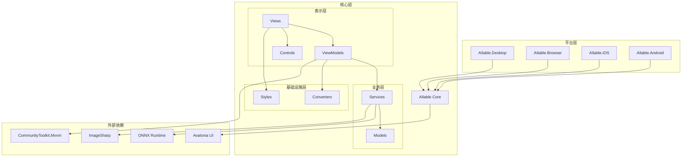
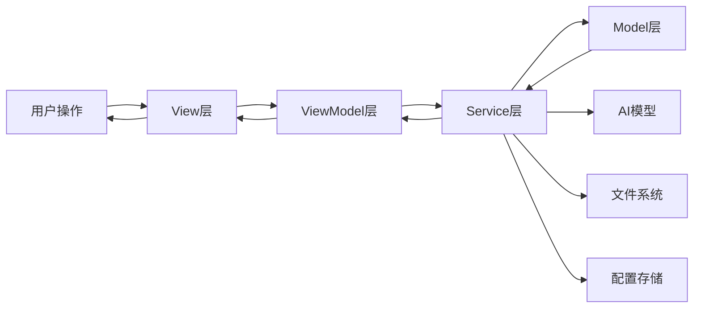

# AIlable项目架构设计文档

## 1. 项目结构分析

### 解决方案结构
AIlable采用多项目解决方案架构，支持跨平台部署：

```
AIlable.sln
├── AIlable (核心项目)           - 共享业务逻辑和UI
├── AIlable.Desktop             - 桌面端入口项目
├── AIlable.Browser             - Web浏览器端项目
├── AIlable.iOS                 - iOS移动端项目
├── AIlable.Android             - Android移动端项目
└── Directory.Packages.props    - 集中包版本管理
```

### 核心项目(AIlable)文件组织

#### 顶层结构
```
AIlable/
├── Program.cs              - 应用程序入口点
├── App.axaml/App.axaml.cs  - 应用程序配置和初始化
├── ViewLocator.cs          - MVVM视图定位器
├── Assets/                 - 静态资源文件
├── Controls/               - 自定义UI控件
├── Converters/             - 数据转换器
├── Models/                 - 数据模型层
├── Services/               - 业务服务层
├── Styles/                 - UI样式定义
├── ViewModels/             - 视图模型层
├── Views/                  - 视图层
├── Scripts/                - Python脚本工具
└── Tests/                  - 测试代码
```

#### 模块职责划分

**1. Models层 - 数据模型**
- `Annotation.cs` - 标注基类
- `RectangleAnnotation.cs` - 矩形标注
- `CircleAnnotation.cs` - 圆形标注
- `PolygonAnnotation.cs` - 多边形标注
- `KeypointAnnotation.cs` - 关键点标注
- `OrientedBoundingBoxAnnotation.cs` - 有向边界框标注
- `AnnotationProject.cs` - 标注项目模型
- `AnnotationImage.cs` - 图像模型
- `ChatMessage.cs` - AI聊天消息模型
- `AIProviderConfig.cs` - AI提供商配置

**2. Services层 - 业务服务**
- **AI模型服务**
  - `AIModelManager.cs` - AI模型管理器
  - `YoloModelService.cs` - YOLO模型服务
  - `OBBModelService.cs` - OBB模型服务
  - `SegmentationModelService.cs` - 分割模型服务
  - `IAIModelService.cs` - AI模型服务接口

- **标注工具服务**
  - `AnnotationTools.cs` - 标注工具集合
  - `KeypointTool.cs` - 关键点工具
  - `OrientedBoundingBoxTool.cs` - OBB工具
  - `SmartToolSwitchingService.cs` - 智能工具切换

- **核心业务服务**
  - `ProjectService.cs` - 项目管理服务
  - `ImageService.cs` - 图像处理服务
  - `ExportService.cs` - 导出服务
  - `UndoRedoService.cs` - 撤销重做服务
  - `NotificationService.cs` - 通知服务

- **AI交互服务**
  - `AIChatService.cs` - AI聊天服务
  - `VoiceRecordingService.cs` - 语音录制服务
  - `AudioService.cs` - 音频处理服务

- **系统服务**
  - `ConfigurationService.cs` - 配置管理服务
  - `ThemeService.cs` - 主题服务
  - `PerformanceMonitorService.cs` - 性能监控
  - `UserExperienceService.cs` - 用户体验服务

**3. ViewModels层 - 视图模型**
- `MainViewModel.cs` - 主视图模型
- `AIChatViewModel.cs` - AI聊天视图模型
- `AIInferenceDialogViewModel.cs` - AI推理对话框模型
- `ExportDialogViewModel.cs` - 导出对话框模型
- `AIModelConfigDialogViewModel.cs` - AI模型配置模型

**4. Views层 - 用户界面**
- `MainView.axaml` - 主界面视图
- `MainWindow.axaml` - 主窗口
- `AIChatView.axaml` - AI聊天界面
- `AIInferenceDialog.axaml` - AI推理对话框
- `ExportDialog.axaml` - 导出对话框

**5. Controls层 - 自定义控件**
- `ImageCanvas.cs` - 图像画布控件
- `CollapsiblePanel.axaml` - 可折叠面板
- `NotificationToast.axaml` - 通知提示控件
- `MarkdownTextBlock.cs` - Markdown文本控件

**6. Styles层 - 样式系统**
- `CommonStyles.axaml` - 通用样式
- `DarkTheme.axaml` - 深色主题
- `LightTheme.axaml` - 浅色主题
- `NotificationStyles.axaml` - 通知样式

### 平台特定项目

**1. AIlable.Desktop**
- 桌面端启动项目
- Windows/Linux/macOS支持
- 完整功能集

**2. AIlable.Browser**
- WebAssembly项目
- 浏览器端运行
- 功能可能受限

**3. AIlable.iOS/Android**
- 移动端项目
- 触摸优化界面
- 平台特定功能

## 2. 依赖关系分析

### 核心依赖包
```xml
<!-- UI框架 -->
Avalonia 11.3.2
Avalonia.Themes.Fluent 11.3.2
Avalonia.Desktop/iOS/Browser/Android 11.3.2

<!-- MVVM框架 -->
CommunityToolkit.Mvvm 8.4.0

<!-- AI模型推理 -->
Microsoft.ML.OnnxRuntime 1.20.1
Microsoft.ML.OnnxRuntime.Extensions 0.12.0

<!-- 图像处理 -->
System.Drawing.Common 9.0.0
SixLabors.ImageSharp 3.1.10

<!-- 序列化 -->
System.Text.Json 9.0.0

<!-- 数学计算 -->
System.Numerics.Vectors 4.6.0
```

### 依赖层次结构
```
平台项目 (Desktop/Browser/iOS/Android)
    ↓
核心项目 (AIlable)
    ↓
外部依赖 (Avalonia, ML.NET, ImageSharp等)
```

## 3. 架构模式分析

### MVVM架构实现
- **Model**: 数据模型和业务逻辑
- **View**: AXAML用户界面
- **ViewModel**: 视图逻辑和数据绑定
- **ViewLocator**: 自动视图定位机制

### 服务层架构
- **接口抽象**: 通过接口定义服务契约
- **依赖注入**: 使用DI容器管理服务生命周期
- **单一职责**: 每个服务专注特定功能领域

### 跨平台架构
- **共享核心**: 业务逻辑和UI在核心项目中共享
- **平台适配**: 各平台项目处理平台特定功能
- **统一API**: 通过抽象层提供统一的平台API

## 4. 设计原则体现

### 分离关注点
- UI逻辑与业务逻辑分离
- 数据模型与视图表示分离
- 平台特定代码与通用代码分离

### 可扩展性
- 插件化的AI模型服务
- 可扩展的标注工具系统
- 模块化的服务架构

### 可测试性
- 接口驱动的设计
- 依赖注入支持
- 独立的业务逻辑层

## 5. 模块依赖关系图



## 6. 数据流向图



这个架构设计体现了良好的分层设计原则，支持跨平台部署，具有良好的可扩展性和可维护性。