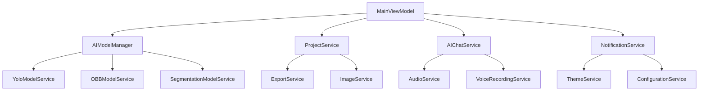

# AIlable项目 - 服务层分析文档

## 概述

AIlable项目的服务层采用分层架构设计，通过依赖注入实现松耦合，提供了完整的业务逻辑支持。服务层包含AI模型推理、项目管理、用户交互、系统功能等多个领域的服务实现。

## 服务层架构设计

### 1. 整体架构
```
服务层架构
├── AI模型服务 (AI Model Services)
│   ├── AIModelManager.cs (AI模型管理器)
│   ├── YoloModelService.cs (YOLO模型服务)
│   ├── OBBModelService.cs (有向边界框模型服务)
│   ├── SegmentationModelService.cs (分割模型服务)
│   └── IAIModelService.cs (AI模型服务接口)
├── 项目管理服务 (Project Management)
│   ├── ProjectService.cs (项目服务)
│   ├── ExportService.cs (导出服务)
│   ├── ObbExportService.cs (OBB导出服务)
│   └── ImageService.cs (图像服务)
├── 用户交互服务 (User Interaction)
│   ├── AIChatService.cs (AI聊天服务)
│   ├── VoiceRecordingService.cs (语音录制服务)
│   ├── AudioService.cs (音频服务)
│   ├── AudioPlayerService.cs (音频播放服务)
│   └── NotificationService.cs (通知服务)
├── 标注工具服务 (Annotation Tools)
│   ├── AnnotationTools.cs (标注工具)
│   ├── AnnotationCommands.cs (标注命令)
│   ├── KeypointTool.cs (关键点工具)
│   ├── OrientedBoundingBoxTool.cs (有向边界框工具)
│   └── SmartToolSwitchingService.cs (智能工具切换)
├── 系统服务 (System Services)
│   ├── ConfigurationService.cs (配置服务)
│   ├── ThemeService.cs (主题服务)
│   ├── UndoRedoService.cs (撤销重做服务)
│   ├── LabelColorService.cs (标签颜色服务)
│   ├── PerformanceMonitorService.cs (性能监控服务)
│   ├── UserExperienceService.cs (用户体验服务)
│   └── FileDialogService.cs (文件对话框服务)
└── 多媒体服务 (Media Services)
    ├── VideoService.cs (视频服务)
    ├── ImageServiceEnhanced.cs (增强图像服务)
    └── NotificationConverters.cs (通知转换器)
```

## AI模型服务分析

### 1. AIModelManager - AI模型管理器

**核心职责**：
- 统一管理多种AI模型服务
- 提供模型加载、卸载、切换功能
- 支持单张和批量图像推理
- 管理项目标签与模型的映射关系

**关键特性**：
```csharp
// 支持的模型类型
private readonly Dictionary<AIModelType, IAIModelService> _modelServices = new()
{
    { AIModelType.YOLO, new YoloModelService() },
    { AIModelType.SegmentAnything, new SegmentationModelService() },
    { AIModelType.Custom, new OBBModelService() }
};

// 核心方法
public async Task<bool> LoadModelAsync(AIModelType modelType, string modelPath)
public async Task<IEnumerable<Annotation>> InferImageAsync(string imagePath, float confidenceThreshold = 0.5f)
public async Task<Dictionary<string, IEnumerable<Annotation>>> InferBatchAsync(IEnumerable<string> imagePaths, float confidenceThreshold = 0.5f)
```

**设计模式**：
- **策略模式**: 不同模型类型使用不同的推理策略
- **工厂模式**: 根据模型类型创建相应的服务实例
- **单例模式**: 全局唯一的模型管理器实例

### 2. YoloModelService - YOLO模型推理服务

**核心功能**：
- 支持YOLO系列模型的ONNX推理
- 自动处理图像预处理和后处理
- 支持多种输出格式（NMS处理后和原始输出）
- 动态类别标签管理

**技术实现**：
```csharp
// 模型推理流程
public async Task<IEnumerable<Annotation>> InferAsync(string imagePath, float confidenceThreshold = 0.5f)
{
    // 1. 图像预处理
    var input = PreprocessImage(image);
    
    // 2. ONNX推理
    using var results = _session.Run(inputs);
    var output = results.FirstOrDefault()?.AsTensor<float>();
    
    // 3. 后处理和NMS
    return PostprocessResults(output, originalWidth, originalHeight, confidenceThreshold);
}
```

**支持的输出格式**：
- **NMS处理后格式**: `[1, 300, 6]` - 已经过非极大值抑制
- **原始输出格式**: `[1, 84, 8400]` - 需要手动NMS处理

**坐标转换系统**：
```csharp
// 模型坐标系 -> 原始图像坐标系
var x1 = (x1_model - padX) / scale;
var y1 = (y1_model - padY) / scale;
var x2 = (x2_model - padX) / scale;
var y2 = (y2_model - padY) / scale;
```

### 3. OBBModelService - 有向边界框模型服务

**特殊功能**：
- 支持旋转目标检测
- 生成OrientedBoundingBoxAnnotation标注
- 处理角度信息和旋转变换

**实现特点**：
```csharp
// 生成有向边界框标注
var obbAnnotation = new OrientedBoundingBoxAnnotation(200, 200, 100, 60, 30)
{
    Id = Guid.NewGuid().ToString(),
    Label = "rotated_object",
    Color = "#FF00FF",
    StrokeWidth = 2,
    IsVisible = true
};
```

## 用户交互服务分析

### 1. AIChatService - AI聊天服务

**多模态支持**：
- **文本消息**: 标准文本对话
- **图像消息**: 支持图像理解和分析
- **音频消息**: 语音输入和输出
- **视频消息**: 视频帧序列分析
- **文件消息**: 文档内容解析

**AI提供商支持**：
```csharp
public enum AIProviderType
{
    OpenAI,      // GPT-4, GPT-4V等
    DeepSeek,    // DeepSeek模型
    AliCloud,    // 阿里云通义千问
    Ollama       // 本地部署模型
}
```

**流式响应处理**：
```csharp
private async IAsyncEnumerable<string> SendMessageStreamAsyncCore(
    string message, 
    List<ChatMessage> history, 
    ChatMessage? currentMessage, 
    CancellationToken cancellationToken)
{
    // 处理Server-Sent Events流
    while ((line = await reader.ReadLineAsync()) != null)
    {
        if (line.StartsWith("data: "))
        {
            var (textContent, audioData) = ParseStreamingResponse(data);
            if (!string.IsNullOrEmpty(textContent))
                yield return textContent;
        }
    }
}
```

**全模态模型支持**：
- **qwen-omni-turbo**: 支持音频输入输出
- **GPT-4V**: 支持图像理解
- **自动格式转换**: 根据模型能力调整消息格式

### 2. VoiceRecordingService - 语音录制服务

**录制功能**：
- 实时音频录制
- 多种音频格式支持
- 音频质量控制
- 录制状态管理

### 3. AudioService & AudioPlayerService - 音频服务

**音频处理能力**：
- 音频文件播放
- 格式转换
- 音量控制
- 播放状态管理

## 项目管理服务分析

### 1. ProjectService - 项目服务

**项目生命周期管理**：
```csharp
// 项目保存
public static async Task<bool> SaveProjectAsync(AnnotationProject project, string filePath)
{
    project.ProjectPath = Path.GetDirectoryName(filePath) ?? "";
    var json = JsonSerializer.Serialize(project, JsonOptions);
    await File.WriteAllTextAsync(filePath, json);
    project.MarkClean();
    return true;
}

// 项目加载
public static async Task<AnnotationProject?> LoadProjectAsync(string filePath)
{
    var json = await File.ReadAllTextAsync(filePath);
    var project = JsonSerializer.Deserialize<AnnotationProject>(json, JsonOptions);
    await ValidateImagePathsAsync(project);
    return project;
}
```

**数据验证和修复**：
- 图像路径验证和修复
- 图像尺寸信息补全
- 项目完整性检查

**导出格式支持**：
```csharp
public static async Task<bool> ExportProjectAsync(AnnotationProject project, ExportFormat format, string outputPath)
{
    return format switch
    {
        ExportFormat.COCO => await ExportService.ExportToCocoAsync(project, outputPath),
        ExportFormat.VOC => await ExportService.ExportToVocAsync(project, outputPath),
        ExportFormat.YOLO => await ExportService.ExportToYoloAsync(project, outputPath, true),
        ExportFormat.JSON => await ExportService.ExportProjectAsync(project, outputPath),
        _ => false
    };
}
```

### 2. ExportService & ObbExportService - 导出服务

**支持的导出格式**：
- **COCO格式**: 标准的目标检测数据集格式
- **VOC格式**: Pascal VOC XML格式
- **YOLO格式**: YOLO训练格式
- **JSON格式**: 项目原生格式
- **OBB格式**: 有向边界框专用格式

## 标注工具服务分析

### 1. AnnotationTools & AnnotationCommands

**工具管理系统**：
- 工具状态管理
- 标注命令封装
- 操作历史记录
- 工具切换逻辑

### 2. SmartToolSwitchingService - 智能工具切换

**智能化特性**：
- 根据上下文自动推荐工具
- 学习用户使用习惯
- 提供工具切换建议

### 3. 专用工具服务

**KeypointTool - 关键点工具**：
- COCO 17点人体关键点
- 骨骼连接绘制
- 关键点可见性管理

**OrientedBoundingBoxTool - 有向边界框工具**：
- 旋转角度控制
- 实时角度显示
- 旋转手柄交互

## 系统服务分析

### 1. ConfigurationService - 配置服务

**配置管理**：
- 应用程序设置
- 用户偏好设置
- AI模型配置
- 导出参数配置

### 2. ThemeService - 主题服务

**主题系统**：
- 深色/浅色主题切换
- 动态资源更新
- 主题持久化存储

### 3. UndoRedoService - 撤销重做服务

**操作历史管理**：
- 命令模式实现
- 操作栈管理
- 批量操作支持
- 内存优化

### 4. LabelColorService - 标签颜色服务

**颜色管理**：
- 标签颜色分配
- 颜色冲突检测
- 自定义颜色方案

### 5. PerformanceMonitorService - 性能监控服务

**性能指标**：
- 内存使用监控
- CPU使用率监控
- 渲染性能统计
- 操作响应时间

### 6. UserExperienceService - 用户体验服务

**体验优化**：
- 用户行为分析
- 操作流程优化
- 界面响应性监控

## 服务间依赖关系

### 1. 依赖注入配置
```csharp
// App.axaml.cs中的服务注册
services.AddSingleton<AIModelManager>();
services.AddSingleton<IAIChatService, AIChatService>();
services.AddSingleton<NotificationService>();
services.AddSingleton<ThemeService>();
services.AddSingleton<ConfigurationService>();
services.AddTransient<FileDialogService>();
```

### 2. 服务依赖图


### 3. 服务生命周期管理

**单例服务**：
- AIModelManager: 全局唯一的模型管理
- AIChatService: 保持聊天会话状态
- ThemeService: 全局主题状态
- ConfigurationService: 全局配置管理

**瞬态服务**：
- FileDialogService: 按需创建的对话框服务
- ExportService: 导出操作的临时服务

## 异步编程模式

### 1. Task-based异步模式
```csharp
// AI推理异步操作
public async Task<IEnumerable<Annotation>> InferAsync(string imagePath, float confidenceThreshold = 0.5f)

// 项目保存异步操作
public static async Task<bool> SaveProjectAsync(AnnotationProject project, string filePath)

// 流式聊天异步操作
public async Task<IAsyncEnumerable<string>> SendMessageStreamAsync(string message, List<ChatMessage> history)
```

### 2. 取消令牌支持
```csharp
// 支持操作取消
public async Task<string> SendMessageAsync(string message, List<ChatMessage> history, CancellationToken cancellationToken = default)
```

### 3. 异步枚举器
```csharp
// 流式数据处理
private async IAsyncEnumerable<string> SendMessageStreamAsyncCore(
    string message, 
    List<ChatMessage> history, 
    ChatMessage? currentMessage, 
    [EnumeratorCancellation] CancellationToken cancellationToken)
```

## 错误处理和日志

### 1. 异常处理策略
```csharp
try
{
    // 业务逻辑
    var result = await ProcessAsync();
    return result;
}
catch (Exception ex)
{
    Console.WriteLine($"Error in service operation: {ex.Message}");
    // 记录详细错误信息
    // 返回默认值或重新抛出
    return defaultValue;
}
```

### 2. 日志记录
- 控制台日志输出
- 调试信息记录
- 错误堆栈跟踪
- 性能指标记录

## 性能优化策略

### 1. 内存管理
- 及时释放ONNX会话资源
- 图像数据的内存优化
- 大文件的流式处理

### 2. 并发处理
- 异步I/O操作
- 并行图像处理
- 线程安全的服务设计

### 3. 缓存策略
- 模型加载缓存
- 图像预处理结果缓存
- 配置信息缓存

## 扩展性设计

### 1. 接口抽象
```csharp
// AI模型服务接口
public interface IAIModelService
{
    bool IsModelLoaded { get; }
    string ModelName { get; }
    AIModelType ModelType { get; }
    
    Task<bool> LoadModelAsync(string modelPath);
    void UnloadModel();
    Task<IEnumerable<Annotation>> InferAsync(string imagePath, float confidenceThreshold = 0.5f);
    Task<Dictionary<string, IEnumerable<Annotation>>> InferBatchAsync(IEnumerable<string> imagePaths, float confidenceThreshold = 0.5f);
}
```

### 2. 插件化架构
- 新AI模型的插件式集成
- 自定义导出格式支持
- 第三方服务集成接口

### 3. 配置驱动
- 通过配置文件扩展功能
- 运行时服务注册
- 动态功能启用/禁用

## 总结

AIlable项目的服务层设计体现了以下特点：

1. **分层清晰**: 按功能域划分服务，职责明确
2. **松耦合**: 通过接口和依赖注入实现解耦
3. **异步优先**: 大量使用异步编程提升响应性
4. **多模态支持**: AI服务支持文本、图像、音频、视频
5. **扩展性强**: 接口抽象和插件化设计
6. **性能优化**: 内存管理、并发处理、缓存策略
7. **错误处理**: 完善的异常处理和日志记录

这种设计为二次开发提供了良好的基础，开发者可以：
- 添加新的AI模型服务
- 扩展导出格式支持
- 集成第三方AI服务
- 自定义标注工具
- 添加新的用户交互功能
- 优化性能和用户体验