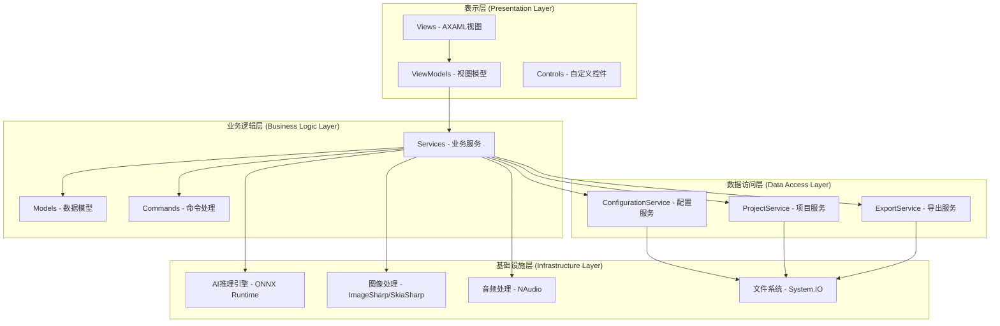
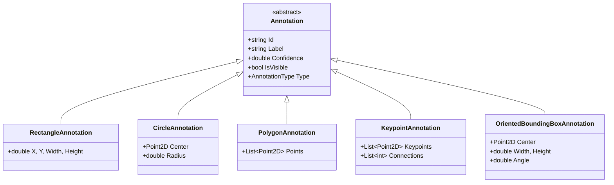
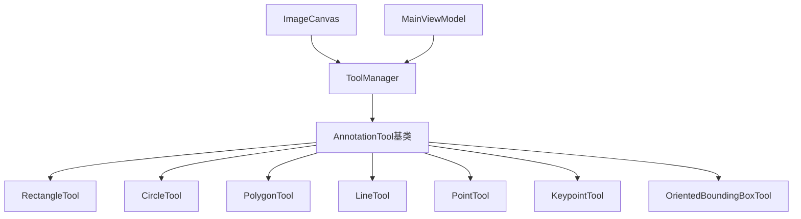
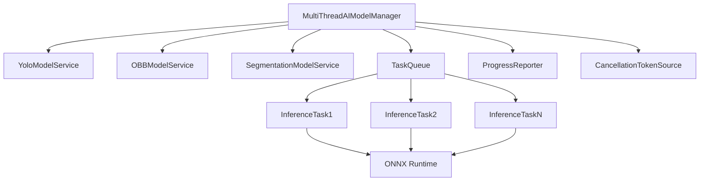

# AIlable项目 - 技术文档

## 项目概述

AIlable是一个基于Avalonia UI框架开发的跨平台图像标注应用程序，采用现代化的MVVM架构模式，支持多种标注类型和AI模型集成。项目使用C#/.NET 9.0技术栈，能够在Desktop、Android、iOS和Browser等多个平台上运行。

### 核心特性
- **多类型标注**: 支持矩形、圆形、多边形、线条、点、关键点、有向边界框等7种标注类型
- **AI模型集成**: 集成YOLO、OBB、分割等多种AI模型，支持自动标注
- **跨平台支持**: 基于Avalonia UI，支持Windows、Linux、macOS、Android、iOS、Browser
- **语音交互**: 支持语音录制和AI语音助手功能
- **项目管理**: 完整的标注项目管理，支持导入导出多种格式
- **现代化UI**: Material Design风格，支持明暗主题切换
- **高性能**: 多线程AI推理，批量处理优化

### 技术栈概览

| 技术领域 | 技术选型 | 版本 | 用途 |
|---------|---------|------|------|
| UI框架 | Avalonia UI | 11.3.2 | 跨平台UI框架 |
| 开发语言 | C# | .NET 9.0 | 主要开发语言 |
| 架构模式 | MVVM | - | 数据绑定和UI分离 |
| MVVM框架 | CommunityToolkit.Mvvm | 8.4.0 | MVVM实现 |
| AI推理 | ONNX Runtime | 1.20.1 | AI模型推理引擎 |
| 图像处理 | ImageSharp | 3.1.10 | 图像加载和处理 |
| 图形渲染 | SkiaSharp | 2.88.8 | 2D图形渲染 |
| 音频处理 | NAudio | 2.2.1 | 音频录制和播放 |
| 序列化 | Newtonsoft.Json | 13.0.3 | JSON数据序列化 |
| 依赖注入 | Microsoft.Extensions.DependencyInjection | 9.0.0 | 服务容器 |
| 配置管理 | Microsoft.Extensions.Configuration | 9.0.0 | 应用配置 |
| 日志系统 | Serilog | 4.2.0 | 结构化日志 |

## 系统架构

### 1. 整体架构图



### 2. MVVM架构实现

#### 2.1 Model层 - 数据模型

**核心数据模型**:
```csharp
// 标注项目模型
public class AnnotationProject
{
    public string Name { get; set; }
    public List<AnnotationImage> Images { get; set; }
    public Dictionary<string, string> Labels { get; set; }
    public ProjectSettings Settings { get; set; }
}

// 标注图像模型
public class AnnotationImage
{
    public string FilePath { get; set; }
    public List<Annotation> Annotations { get; set; }
    public ImageMetadata Metadata { get; set; }
}

// 标注基类
public abstract class Annotation
{
    public string Id { get; set; }
    public string Label { get; set; }
    public double Confidence { get; set; }
    public bool IsVisible { get; set; }
    public abstract AnnotationType Type { get; }
}
```

**标注类型层次结构**:


#### 2.2 View层 - 用户界面

**主要视图组件**:
- **MainView**: 主界面，包含图像显示、工具栏、属性面板
- **AIChatView**: AI聊天界面，支持语音和文本交互
- **AIInferenceDialog**: AI推理配置对话框
- **ExportDialog**: 导出配置对话框

**自定义控件**:
- **ImageCanvas**: 图像显示和标注绘制控件
- **CollapsiblePanel**: 可折叠面板控件
- **NotificationToast**: 通知提示控件
- **MarkdownTextBlock**: Markdown文本显示控件

#### 2.3 ViewModel层 - 视图模型

**主要视图模型**:
```csharp
// 主视图模型
public partial class MainViewModel : ViewModelBase
{
    [ObservableProperty] private AnnotationProject? currentProject;
    [ObservableProperty] private AnnotationImage? currentImage;
    [ObservableProperty] private AnnotationTool selectedTool;
    [ObservableProperty] private bool isAIInferenceRunning;
    
    // 命令
    [RelayCommand] private async Task LoadProject();
    [RelayCommand] private async Task SaveProject();
    [RelayCommand] private async Task RunAIInference();
}

// AI聊天视图模型
public partial class AIChatViewModel : ViewModelBase
{
    [ObservableProperty] private ObservableCollection<ChatMessage> messages;
    [ObservableProperty] private string currentMessage;
    [ObservableProperty] private bool isRecording;
    
    [RelayCommand] private async Task SendMessage();
    [RelayCommand] private async Task StartVoiceRecording();
}
```

### 3. 服务层架构

#### 3.1 核心服务接口

```csharp
// AI模型服务接口
public interface IAIModelService
{
    Task<List<Annotation>> InferAsync(string imagePath, double confidenceThreshold);
    Task LoadModelAsync(string modelPath);
    bool IsModelLoaded { get; }
    string ModelName { get; }
}

// 配置服务接口
public interface IConfigurationService
{
    Task<List<AIProviderConfig>> LoadProvidersAsync();
    Task SaveProvidersAsync(List<AIProviderConfig> providers);
    Task<AIProviderConfig?> GetLastUsedProviderAsync();
}

// 项目服务接口
public interface IProjectService
{
    Task<AnnotationProject> LoadProjectAsync(string filePath);
    Task SaveProjectAsync(AnnotationProject project, string filePath);
    Task<List<string>> GetRecentProjectsAsync();
}
```

#### 3.2 服务依赖注入配置

```csharp
public static class ServiceCollectionExtensions
{
    public static IServiceCollection AddAIlableServices(this IServiceCollection services)
    {
        // 核心服务
        services.AddSingleton<IConfigurationService, ConfigurationService>();
        services.AddSingleton<IProjectService, ProjectService>();
        services.AddSingleton<IThemeService, ThemeService>();
        services.AddSingleton<INotificationService, NotificationService>();
        
        // AI服务
        services.AddSingleton<IAIModelManager, MultiThreadAIModelManager>();
        services.AddTransient<IAIModelService, YoloModelService>();
        services.AddTransient<IAIModelService, OBBModelService>();
        services.AddTransient<IAIModelService, SegmentationModelService>();
        
        // 工具服务
        services.AddSingleton<IUndoRedoService, UndoRedoService>();
        services.AddSingleton<IFileDialogService, FileDialogService>();
        services.AddSingleton<IImageService, ImageServiceEnhanced>();
        services.AddSingleton<IAudioService, AudioService>();
        
        // 业务服务
        services.AddSingleton<IExportService, ExportService>();
        services.AddSingleton<IObbExportService, ObbExportService>();
        services.AddSingleton<IPerformanceMonitorService, PerformanceMonitorService>();
        
        return services;
    }
}
```

## 核心功能模块

### 1. 图像标注模块

#### 1.1 标注工具系统



**标注工具接口**:
```csharp
public interface IAnnotationTool
{
    AnnotationType ToolType { get; }
    bool IsDrawing { get; }
    
    void StartDrawing(Point startPoint);
    void UpdateDrawing(Point currentPoint);
    Annotation? FinishDrawing();
    void CancelDrawing();
    
    void Render(DrawingContext context, Annotation annotation);
}
```

#### 1.2 图像画布控件

**ImageCanvas核心功能**:
```csharp
public class ImageCanvas : Control
{
    // 图像显示
    public static readonly StyledProperty<Bitmap?> ImageProperty;
    
    // 标注集合
    public static readonly StyledProperty<ObservableCollection<Annotation>> AnnotationsProperty;
    
    // 当前工具
    public static readonly StyledProperty<IAnnotationTool?> CurrentToolProperty;
    
    // 缩放和平移
    public static readonly StyledProperty<double> ZoomFactorProperty;
    public static readonly StyledProperty<Point> PanOffsetProperty;
    
    // 渲染方法
    public override void Render(DrawingContext context)
    {
        // 1. 渲染背景图像
        RenderImage(context);
        
        // 2. 渲染所有标注
        RenderAnnotations(context);
        
        // 3. 渲染当前绘制的标注
        RenderCurrentDrawing(context);
    }
}
```

### 2. AI模型集成模块

#### 2.1 多线程AI推理架构



**多线程推理管理器**:
```csharp
public class MultiThreadAIModelManager : IAIModelManager
{
    private readonly SemaphoreSlim _semaphore;
    private readonly ConcurrentQueue<InferenceTask> _taskQueue;
    private readonly IProgress<InferenceProgress> _progressReporter;
    
    public async Task<List<InferenceResult>> BatchInferAsync(
        List<string> imagePaths,
        IAIModelService modelService,
        double confidenceThreshold,
        CancellationToken cancellationToken = default,
        IProgress<InferenceProgress>? progress = null)
    {
        var results = new ConcurrentBag<InferenceResult>();
        var totalTasks = imagePaths.Count;
        var completedTasks = 0;
        
        var tasks = imagePaths.Select(async imagePath =>
        {
            await _semaphore.WaitAsync(cancellationToken);
            try
            {
                var annotations = await modelService.InferAsync(imagePath, confidenceThreshold);
                results.Add(new InferenceResult(imagePath, annotations));
                
                var completed = Interlocked.Increment(ref completedTasks);
                progress?.Report(new InferenceProgress(completed, totalTasks, imagePath));
            }
            finally
            {
                _semaphore.Release();
            }
        });
        
        await Task.WhenAll(tasks);
        return results.ToList();
    }
}
```

#### 2.2 YOLO模型服务

**YOLO推理实现**:
```csharp
public class YoloModelService : IAIModelService
{
    private InferenceSession? _session;
    private YoloModelMetadata? _metadata;
    
    public async Task<List<Annotation>> InferAsync(string imagePath, double confidenceThreshold)
    {
        if (_session == null) throw new InvalidOperationException("模型未加载");
        
        // 1. 图像预处理
        var inputTensor = await PreprocessImageAsync(imagePath);
        
        // 2. 模型推理
        var inputs = new List<NamedOnnxValue>
        {
            NamedOnnxValue.CreateFromTensor("images", inputTensor)
        };
        
        using var results = _session.Run(inputs);
        var outputTensor = results.First().AsTensor<float>();
        
        // 3. 后处理
        var detections = PostprocessOutput(outputTensor, confidenceThreshold);
        
        // 4. 转换为标注对象
        return ConvertToAnnotations(detections);
    }
    
    private async Task<DenseTensor<float>> PreprocessImageAsync(string imagePath)
    {
        using var image = await Image.LoadAsync<Rgb24>(imagePath);
        
        // 调整图像大小到模型输入尺寸
        image.Mutate(x => x.Resize(_metadata.InputWidth, _metadata.InputHeight));
        
        // 转换为张量格式 [1, 3, H, W]
        var tensor = new DenseTensor<float>(new[] { 1, 3, _metadata.InputHeight, _metadata.InputWidth });
        
        // 像素值归一化到 [0, 1]
        for (int y = 0; y < _metadata.InputHeight; y++)
        {
            for (int x = 0; x < _metadata.InputWidth; x++)
            {
                var pixel = image[x, y];
                tensor[0, 0, y, x] = pixel.R / 255.0f;
                tensor[0, 1, y, x] = pixel.G / 255.0f;
                tensor[0, 2, y, x] = pixel.B / 255.0f;
            }
        }
        
        return tensor;
    }
}
```

### 3. 语音交互模块

#### 3.1 语音录制服务

```csharp
public class VoiceRecordingService : IDisposable
{
    private WaveInEvent? _waveIn;
    private WaveFileWriter? _writer;
    private readonly string _tempFilePath;
    
    public async Task StartRecordingAsync()
    {
        _waveIn = new WaveInEvent
        {
            WaveFormat = new WaveFormat(16000, 1) // 16kHz, 单声道
        };
        
        _writer = new WaveFileWriter(_tempFilePath, _waveIn.WaveFormat);
        _waveIn.DataAvailable += OnDataAvailable;
        _waveIn.RecordingStopped += OnRecordingStopped;
        
        _waveIn.StartRecording();
    }
    
    public async Task<string> StopRecordingAsync()
    {
        _waveIn?.StopRecording();
        await Task.Delay(100); // 等待录制完成
        
        _writer?.Dispose();
        _waveIn?.Dispose();
        
        return _tempFilePath;
    }
}
```

#### 3.2 AI聊天服务

```csharp
public class AIChatService
{
    private readonly HttpClient _httpClient;
    private readonly IConfigurationService _configService;
    
    public async Task<string> SendMessageAsync(string message, List<ChatMessage> history)
    {
        var provider = await _configService.GetLastUsedProviderAsync();
        if (provider == null) throw new InvalidOperationException("未配置AI提供商");
        
        var request = new
        {
            model = provider.Model,
            messages = BuildMessageHistory(message, history),
            max_tokens = provider.MaxTokens,
            temperature = provider.Temperature
        };
        
        var response = await _httpClient.PostAsJsonAsync(provider.BaseUrl + "/chat/completions", request);
        var result = await response.Content.ReadFromJsonAsync<ChatCompletionResponse>();
        
        return result?.Choices?.FirstOrDefault()?.Message?.Content ?? "无响应";
    }
}
```

### 4. 项目管理模块

#### 4.1 项目序列化

```csharp
public class ProjectService : IProjectService
{
    public async Task<AnnotationProject> LoadProjectAsync(string filePath)
    {
        var json = await File.ReadAllTextAsync(filePath);
        var project = JsonConvert.DeserializeObject<AnnotationProject>(json, new JsonSerializerSettings
        {
            TypeNameHandling = TypeNameHandling.Auto,
            Converters = { new AnnotationConverter() }
        });
        
        return project ?? throw new InvalidDataException("项目文件格式错误");
    }
    
    public async Task SaveProjectAsync(AnnotationProject project, string filePath)
    {
        var json = JsonConvert.SerializeObject(project, Formatting.Indented, new JsonSerializerSettings
        {
            TypeNameHandling = TypeNameHandling.Auto,
            Converters = { new AnnotationConverter() }
        });
        
        await File.WriteAllTextAsync(filePath, json);
    }
}
```

#### 4.2 导出服务

**YOLO格式导出**:
```csharp
public class ExportService : IExportService
{
    public async Task ExportToYoloAsync(AnnotationProject project, string outputDirectory)
    {
        // 创建输出目录结构
        var imagesDir = Path.Combine(outputDirectory, "images");
        var labelsDir = Path.Combine(outputDirectory, "labels");
        Directory.CreateDirectory(imagesDir);
        Directory.CreateDirectory(labelsDir);
        
        // 生成类别文件
        var classNames = project.Labels.Values.ToList();
        await File.WriteAllLinesAsync(Path.Combine(outputDirectory, "classes.txt"), classNames);
        
        // 导出每个图像和标注
        foreach (var image in project.Images)
        {
            // 复制图像文件
            var imageName = Path.GetFileName(image.FilePath);
            var targetImagePath = Path.Combine(imagesDir, imageName);
            File.Copy(image.FilePath, targetImagePath, true);
            
            // 生成YOLO格式标注文件
            var labelName = Path.GetFileNameWithoutExtension(imageName) + ".txt";
            var labelPath = Path.Combine(labelsDir, labelName);
            
            var yoloLines = image.Annotations
                .OfType<RectangleAnnotation>()
                .Select(ann => ConvertToYoloFormat(ann, image.Metadata, classNames));
                
            await File.WriteAllLinesAsync(labelPath, yoloLines);
        }
    }
    
    private string ConvertToYoloFormat(RectangleAnnotation annotation, ImageMetadata metadata, List<string> classNames)
    {
        var classIndex = classNames.IndexOf(annotation.Label);
        var centerX = (annotation.X + annotation.Width / 2) / metadata.Width;
        var centerY = (annotation.Y + annotation.Height / 2) / metadata.Height;
        var width = annotation.Width / metadata.Width;
        var height = annotation.Height / metadata.Height;
        
        return $"{classIndex} {centerX:F6} {centerY:F6} {width:F6} {height:F6}";
    }
}
```

## 性能优化

### 1. 多线程优化

**AI推理并发处理**:
- 使用`SemaphoreSlim`控制并发数量，避免资源竞争
- 采用`ConcurrentBag`收集结果，线程安全
- 实现进度报告和取消机制

**UI响应性优化**:
- 所有耗时操作使用`async/await`异步处理
- 图像加载和处理在后台线程执行
- 使用`Dispatcher.InvokeAsync`更新UI

### 2. 内存管理

**图像资源管理**:
```csharp
public class ImageCache : IDisposable
{
    private readonly LRUCache<string, WeakReference<Bitmap>> _cache;
    private readonly SemaphoreSlim _semaphore;
    
    public async Task<Bitmap?> GetImageAsync(string filePath)
    {
        await _semaphore.WaitAsync();
        try
        {
            if (_cache.TryGetValue(filePath, out var weakRef) && 
                weakRef.TryGetTarget(out var cachedBitmap))
            {
                return cachedBitmap;
            }
            
            var bitmap = await LoadImageAsync(filePath);
            _cache[filePath] = new WeakReference<Bitmap>(bitmap);
            return bitmap;
        }
        finally
        {
            _semaphore.Release();
        }
    }
}
```

### 3. 渲染优化

**图像画布优化**:
- 使用脏区域重绘，只更新变化的部分
- 实现视口裁剪，只渲染可见区域的标注
- 使用硬件加速渲染

```csharp
public override void Render(DrawingContext context)
{
    // 计算可见区域
    var visibleBounds = GetVisibleBounds();
    
    // 只渲染可见区域内的标注
    var visibleAnnotations = Annotations.Where(ann => 
        IsAnnotationVisible(ann, visibleBounds));
    
    foreach (var annotation in visibleAnnotations)
    {
        RenderAnnotation(context, annotation);
    }
}
```

## 跨平台适配

### 1. 平台特定实现

**文件对话框服务**:
```csharp
public class FileDialogService : IFileDialogService
{
    public async Task<string[]?> OpenFileDialogAsync(FileDialogFilter[] filters)
    {
        var dialog = new OpenFileDialog
        {
            AllowMultiple = true,
            Filters = filters.ToList()
        };
        
        var window = GetActiveWindow();
        return await dialog.ShowAsync(window);
    }
    
    private Window GetActiveWindow()
    {
        // 跨平台获取活动窗口
        return Application.Current?.ApplicationLifetime is IClassicDesktopStyleApplicationLifetime desktop
            ? desktop.MainWindow ?? throw new InvalidOperationException("无活动窗口")
            : throw new PlatformNotSupportedException("不支持的平台");
    }
}
```

### 2. 平台资源适配

**Android资源配置**:
```xml
<!-- Resources/values/styles.xml -->
<resources>
    <style name="MyTheme.Splash" parent="Theme.AppCompat.Light.NoActionBar">
        <item name="android:windowBackground">@drawable/splash_background</item>
        <item name="android:windowNoTitle">true</item>
        <item name="android:windowFullscreen">true</item>
    </style>
</resources>
```

**iOS资源配置**:
```xml
<!-- Info.plist -->
<key>UILaunchStoryboardName</key>
<string>LaunchScreen</string>
<key>UIRequiredDeviceCapabilities</key>
<array>
    <string>armv7</string>
</array>
```

## API参考

### 1. 核心接口

#### IAIModelService
```csharp
public interface IAIModelService
{
    /// <summary>
    /// 模型名称
    /// </summary>
    string ModelName { get; }
    
    /// <summary>
    /// 模型是否已加载
    /// </summary>
    bool IsModelLoaded { get; }
    
    /// <summary>
    /// 加载模型
    /// </summary>
    /// <param name="modelPath">模型文件路径</param>
    Task LoadModelAsync(string modelPath);
    
    /// <summary>
    /// 执行推理
    /// </summary>
    /// <param name="imagePath">图像文件路径</param>
    /// <param name="confidenceThreshold">置信度阈值</param>
    /// <returns>检测到的标注列表</returns>
    Task<List<Annotation>> InferAsync(string imagePath, double confidenceThreshold);
    
    /// <summary>
    /// 批量推理
    /// </summary>
    /// <param name="imagePaths">图像文件路径列表</param>
    /// <param name="confidenceThreshold">置信度阈值</param>
    /// <param name="progress">进度报告</param>
    /// <param name="cancellationToken">取消令牌</param>
    /// <returns>推理结果列表</returns>
    Task<List<InferenceResult>> BatchInferAsync(
        List<string> imagePaths, 
        double confidenceThreshold,
        IProgress<InferenceProgress>? progress = null,
        CancellationToken cancellationToken = default);
}
```

#### IProjectService
```csharp
public interface IProjectService
{
    /// <summary>
    /// 加载项目
    /// </summary>
    /// <param name="filePath">项目文件路径</param>
    /// <returns>标注项目</returns>
    Task<AnnotationProject> LoadProjectAsync(string filePath);
    
    /// <summary>
    /// 保存项目
    /// </summary>
    /// <param name="project">标注项目</param>
    /// <param name="filePath">保存路径</param>
    Task SaveProjectAsync(AnnotationProject project, string filePath);
    
    /// <summary>
    /// 获取最近项目列表
    /// </summary>
    /// <returns>最近项目路径列表</returns>
    Task<List<string>> GetRecentProjectsAsync();
    
    /// <summary>
    /// 添加到最近项目
    /// </summary>
    /// <param name="projectPath">项目路径</param>
    Task AddToRecentProjectsAsync(string projectPath);
}
```

### 2. 数据模型

#### AnnotationProject
```csharp
public class AnnotationProject
{
    /// <summary>
    /// 项目名称
    /// </summary>
    public string Name { get; set; } = string.Empty;
    
    /// <summary>
    /// 项目描述
    /// </summary>
    public string Description { get; set; } = string.Empty;
    
    /// <summary>
    /// 创建时间
    /// </summary>
    public DateTime CreatedAt { get; set; }
    
    /// <summary>
    /// 最后修改时间
    /// </summary>
    public DateTime LastModified { get; set; }
    
    /// <summary>
    /// 图像列表
    /// </summary>
    public List<AnnotationImage> Images { get; set; } = new();
    
    /// <summary>
    /// 标签映射 (ID -> 显示名称)
    /// </summary>
    public Dictionary<string, string> Labels { get; set; } = new();
    
    /// <summary>
    /// 项目设置
    /// </summary>
    public ProjectSettings Settings { get; set; } = new();
}
```

#### Annotation基类
```csharp
public abstract class Annotation
{
    /// <summary>
    /// 标注唯一标识
    /// </summary>
    public string Id { get; set; } = Guid.NewGuid().ToString();
    
    /// <summary>
    /// 标注标签
    /// </summary>
    public string Label { get; set; } = string.Empty;
    
    /// <summary>
    /// 置信度 (0.0 - 1.0)
    /// </summary>
    public double Confidence { get; set; } = 1.0;
    
    /// <summary>
    /// 是否可见
    /// </summary>
    public bool IsVisible { get; set; } = true;
    
    /// <summary>
    /// 是否被选中
    /// </summary>
    public bool IsSelected { get; set; } = false;
    
    /// <summary>
    /// 标注类型
    /// </summary>
    public abstract AnnotationType Type { get; }
    
    /// <summary>
    /// 创建时间
    /// </summary>
    public DateTime CreatedAt { get; set; } = DateTime.Now;
    
    /// <summary>
    /// 获取边界框
    /// </summary>
    /// <returns>标注的边界矩形</returns>
    public abstract Rect GetBounds();
    
    /// <summary>
    /// 判断点是否在标注内
    /// </summary>
    /// <param name="point">测试点</param>
    /// <returns>是否包含该点</returns>
    public abstract bool Contains(Point point);
}
```

### 3. 事件和委托

#### InferenceProgress
```csharp
public class InferenceProgress
{
    /// <summary>
    /// 已完成的任务数
    /// </summary>
    public int CompletedTasks { get; set; }
    
    /// <summary>
    /// 总任务数
    /// </summary>
    public int TotalTasks { get; set; }
    
    /// <summary>
    /// 当前处理的图像路径
    /// </summary>
    public string CurrentImagePath { get; set; } = string.Empty;
    
    /// <summary>
    /// 进度百分比 (0-100)
    /// </summary>
    public double ProgressPercentage => TotalTasks > 0 ? (double)CompletedTasks / TotalTasks * 100 : 0;
    
    /// <summary>
    /// 是否已完成
    /// </summary>
    public bool IsCompleted => CompletedTasks >= TotalTasks;
}
```

## 开发指南

### 1. 环境搭建

#### 开发环境要求
- **.NET SDK**: 9.0 或更高版本
- **IDE**: Visual Studio 2022 / JetBrains Rider / VS Code
- **操作系统**: Windows 10/11, macOS 10.15+, Ubuntu 18.04+

#### 克隆和构建项目
```bash
# 克隆项目
git clone <repository-url>
cd AIlable

# 还原依赖
dotnet restore

# 构建项目
dotnet build

# 运行桌面版本
dotnet run --project AIlable.Desktop
```

### 2. 添加新的标注类型

#### 步骤1: 创建标注模型
```csharp
// Models/CustomAnnotation.cs
public class CustomAnnotation : Annotation
{
    public override AnnotationType Type => AnnotationType.Custom;
    
    // 自定义属性
    public string CustomProperty { get; set; } = string.Empty;
    
    public override Rect GetBounds()
    {
        // 实现边界框计算
        return new Rect();
    }
    
    public override bool Contains(Point point)
    {
        // 实现点包含检测
        return false;
    }
}
```

#### 步骤2: 添加枚举值
```csharp
// Models/Enums.cs
public enum AnnotationType
{
    Rectangle,
    Circle,
    Polygon,
    Line,
    Point,
    Keypoint,
    OrientedBoundingBox,
    Custom // 新增
}
```

#### 步骤3: 创建标注工具
```csharp
// Services/CustomTool.cs
public class CustomTool : IAnnotationTool
{
    public AnnotationType ToolType => AnnotationType.Custom;
    public bool IsDrawing { get; private set; }
    
    public void StartDrawing(Point startPoint)
    {
        IsDrawing = true;
        // 开始绘制逻辑
    }
    
    public void UpdateDrawing(Point currentPoint)
    {
        // 更新绘制逻辑
    }
    
    public Annotation? FinishDrawing()
    {
        IsDrawing = false;
        // 完成绘制，返回标注对象
        return new CustomAnnotation();
    }
    
    public void CancelDrawing()
    {
        IsDrawing = false;
        // 取消绘制逻辑
    }
    
    public void Render(DrawingContext context, Annotation annotation)
    {
        if (annotation is CustomAnnotation custom)
        {
            // 渲染自定义标注
        }
    }
}
```

#### 步骤4: 注册工具
```csharp
// 在服务注册中添加
services.AddTransient<IAnnotationTool, CustomTool>();
```

### 3. 集成新的AI模型

#### 步骤1: 实现模型服务
```csharp
// Services/CustomModelService.cs
public class CustomModelService : IAIModelService
{
    private InferenceSession? _session;
    
    public string ModelName => "Custom Model";
    public bool IsModelLoaded => _session != null;
    
    public async Task LoadModelAsync(string modelPath)
    {
        _session = new InferenceSession(modelPath);
        // 模型加载逻辑
    }
    
    public async Task<List<Annotation>> InferAsync(string imagePath, double confidenceThreshold)
    {
        if (_session == null) throw new InvalidOperationException("模型未加载");
        
        // 1. 图像预处理
        var inputTensor = await PreprocessImageAsync(imagePath);
        
        // 2. 模型推理
        var inputs = new List<NamedOnnxValue>
        {
            NamedOnnxValue.CreateFromTensor("input", inputTensor)
        };
        
        using var results = _session.Run(inputs);
        var outputTensor = results.First().AsTensor<float>();
        
        // 3. 后处理
        return PostprocessOutput(outputTensor, confidenceThreshold);
    }
    
    private async Task<DenseTensor<float>> PreprocessImageAsync(string imagePath)
    {
        // 图像预处理逻辑
        return new DenseTensor<float>(new[] { 1, 3, 640, 640 });
    }
    
    private List<Annotation> PostprocessOutput(Tensor<float> output, double threshold)
    {
        // 输出后处理逻辑
        return new List<Annotation>();
    }
}
```

#### 步骤2: 注册模型服务
```csharp
// 在依赖注入容器中注册
services.AddTransient<IAIModelService, CustomModelService>();
```

### 4. 添加新的导出格式

#### 步骤1: 实现导出服务
```csharp
// Services/CustomExportService.cs
public class CustomExportService
{
    public async Task ExportToCustomFormatAsync(AnnotationProject project, string outputPath)
    {
        var customData = new
        {
            ProjectName = project.Name,
            Images = project.Images.Select(img => new
            {
                Path = img.FilePath,
                Annotations = img.Annotations.Select(ann => new
                {
                    Type = ann.Type.ToString(),
                    Label = ann.Label,
                    Confidence = ann.Confidence,
                    // 根据标注类型添加具体数据
                    Data = SerializeAnnotationData(ann)
                })
            })
        };
        
        var json = JsonConvert.SerializeObject(customData, Formatting.Indented);
        await File.WriteAllTextAsync(outputPath, json);
    }
    
    private object SerializeAnnotationData(Annotation annotation)
    {
        return annotation switch
        {
            RectangleAnnotation rect => new { rect.X, rect.Y, rect.Width, rect.Height },
            CircleAnnotation circle => new { circle.Center, circle.Radius },
            // 添加其他类型的序列化
            _ => new { }
        };
    }
}
```

### 5. 自定义主题

#### 步骤1: 创建主题文件
```xml
<!-- Styles/CustomTheme.axaml -->
<Styles xmlns="https://github.com/avaloniaui"
        xmlns:x="http://schemas.microsoft.com/winfx/2006/xaml">
    
    <!-- 自定义颜色 -->
    <Style.Resources>
        <SolidColorBrush x:Key="CustomPrimaryBrush">#FF6B46C1</SolidColorBrush>
        <SolidColorBrush x:Key="CustomSecondaryBrush">#FF10B981</SolidColorBrush>
        <SolidColorBrush x:Key="CustomBackgroundBrush">#FF1F2937</SolidColorBrush>
    </Style.Resources>
    
    <!-- 按钮样式 -->
    <Style Selector="Button.custom-primary">
        <Setter Property="Background" Value="{DynamicResource CustomPrimaryBrush}" />
        <Setter Property="Foreground" Value="White" />
        <Setter Property="CornerRadius" Value="8" />
    </Style>
    
</Styles>
```

#### 步骤2: 扩展主题服务
```csharp
// 扩展主题枚举
public enum AppTheme
{
    Light,
    Dark,
    Custom // 新增
}

// 在ThemeService中添加自定义主题支持
private void ApplyTheme(AppTheme theme)
{
    switch (theme)
    {
        case AppTheme.Custom:
            app.Styles.Add(new StyleInclude(new Uri("avares://AIlable/Styles/CustomTheme.axaml")));
            break;
        // 其他主题...
    }
}
```

## 故障排除

### 1. 常见问题

#### 问题1: ONNX模型加载失败
**症状**: 抛出`OnnxRuntimeException`异常
**解决方案**:
```csharp
try
{
    _session = new InferenceSession(modelPath, SessionOptions.MakeSessionOptionWithCudaProvider());
}
catch (OnnxRuntimeException ex) when (ex.Message.Contains("CUDA"))
{
    // 回退到CPU推理
    _session = new InferenceSession(modelPath);
}
```

#### 问题2: 图像加载内存溢出
**症状**: `OutOfMemoryException`异常
**解决方案**:
```csharp
// 使用图像缓存和延迟加载
public async Task<Bitmap> LoadImageAsync(string path)
{
    using var stream = File.OpenRead(path);
    using var image = await Image.LoadAsync<Rgba32>(stream);
    
    // 限制图像大小
    if (image.Width > 4096 || image.Height > 4096)
    {
        var scale = Math.Min(4096.0 / image.Width, 4096.0 / image.Height);
        var newWidth = (int)(image.Width * scale);
        var newHeight = (int)(image.Height * scale);
        image.Mutate(x => x.Resize(newWidth, newHeight));
    }
    
    return ConvertToBitmap(image);
}
```

#### 问题3: 跨平台文件路径问题
**症状**: 在不同平台上文件路径不正确
**解决方案**:
```csharp
// 使用Path.Combine和Path.GetFullPath
public string GetPlatformPath(params string[] paths)
{
    return Path.GetFullPath(Path.Combine(paths));
}

// 使用相对路径存储
public string GetRelativePath(string basePath, string fullPath)
{
    return Path.GetRelativePath(basePath, fullPath);
}
```

### 2. 性能优化建议

#### 图像处理优化
```csharp
// 使用对象池减少GC压力
private readonly ObjectPool<byte[]> _bufferPool = new DefaultObjectPool<byte[]>(
    new DefaultPooledObjectPolicy<byte[]>());

public async Task<Bitmap> ProcessImageAsync(string path)
{
    var buffer = _bufferPool.Get();
    try
    {
        // 使用缓冲区处理图像
        return await ProcessWithBuffer(path, buffer);
    }
    finally
    {
        _bufferPool.Return(buffer);
    }
}
```

#### UI渲染优化
```csharp
// 使用虚拟化减少渲染开销
public override void Render(DrawingContext context)
{
    var visibleBounds = GetVisibleBounds();
    var visibleAnnotations = Annotations.Where(ann => 
        ann.GetBounds().Intersects(visibleBounds));
    
    foreach (var annotation in visibleAnnotations)
    {
        RenderAnnotation(context, annotation);
    }
}
```

## 总结

AIlable项目是一个功能完整、架构清晰的跨平台图像标注应用程序。通过本技术文档，开发者可以：

1. **理解项目架构**: 掌握MVVM模式、服务层设计、跨平台适配等核心概念
2. **扩展功能模块**: 添加新的标注类型、AI模型、导出格式等
3. **优化性能**: 了解多线程处理、内存管理、渲染优化等技术
4. **解决问题**: 参考故障排除指南快速定位和解决常见问题

项目采用了现代化的.NET技术栈和最佳实践，为二次开发提供了良好的基础。开发者可以基于现有架构快速实现自定义功能，同时保持代码的可维护性和扩展性。
# AIlable项目 - 技术文档

## 项目概述

AIlable是一个基于Avalonia UI框架开发的跨平台图像标注应用程序，采用现代化的MVVM架构模式，支持多种标注类型和AI模型集成。项目使用C#/.NET 9.0技术栈，能够在Desktop、Android、iOS和Browser等多个平台上运行。

### 核心特性
- **多